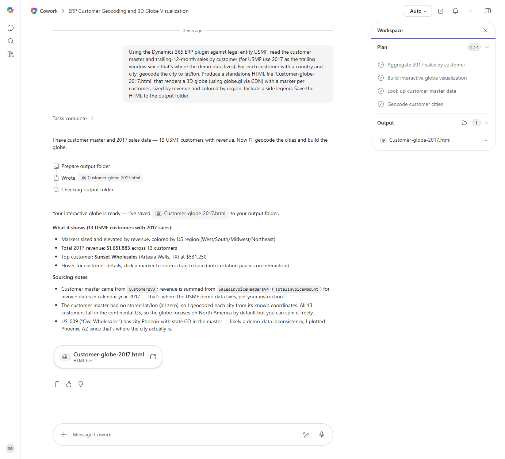

# Customer Revenue 3D Globe Visualization

Builds an interactive 3D globe HTML visualization plotting customer locations sized by trailing-12-month revenue.

> ℹ **Tenant data caveat.** Validated end-to-end against a live Cowork tenant on 2026-05-23 with USMF 2017 sales data. Cowork ran all four plan steps and produced 'Customer-globe-2017.html' - a standalone interactive 3D globe (globe.gl via CDN) with 13 USMF customer markers sized/elevated by revenue and colored by US region (West/South/Midwest/Northeast). Total 2017 revenue $1,651,883; top customer Sunset Wholesales (Artesia Wells, TX) at $531,250. Cowork geocoded each city from known coordinates (the customer master had no stored lat/lon) and flagged a data inconsistency: US-009 'Owl Wholesales' has city=Phoenix with state=CO in the master; Cowork plotted Phoenix, AZ instead. Sourced from CustomersV3 + SalesInvoiceHeadersV4.TotalInvoiceAmount for invoice dates in calendar year 2017.

## Business value

Turns the customer master and revenue tape into an exec-ready visual that makes geographic concentration risk and growth pockets immediately obvious.

## What it does

Visualizes customer revenue on a 3D globe as a standalone HTML file.

## Prerequisites

- Dynamics 365 F&SCM read access

## Step-by-step

1. Paste the prompt.
2. Open the saved HTML file in your browser to explore.

## Expected output

One standalone interactive HTML file.

## Skills used

OOTB: PDF
Plugin actions: dynamics-365-erp/data_find_entity_type, dynamics-365-erp/data_find_entities_sql

## License

CC-BY-4.0 — see repo `LICENSE`.
