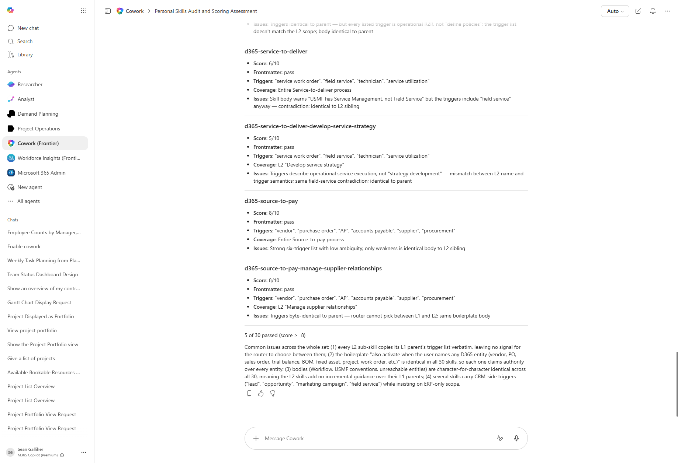

# D365 Manage accounts receivable Expert

A Dynamics 365 F&SCM expert scoped to the Manage accounts receivable area (a level-2 subdomain of Order to cash) - covers 13 L3 processes.

> ℹ **This is a Cowork custom skill.** Place the contents of the `skill/` folder under `Documents/Cowork/skills/d365-order-to-cash-manage-accounts-receivable/` in your OneDrive. Cowork auto-discovers custom skills at the start of each conversation.

## How to install

The recipe page above ships a one-click **Download skill.zip** button (extracted from this repo's `skill.zip` + `skill.zip.sha256` for tamper-evidence). To install:

1. Click **Download skill.zip** on the recipe page.
2. Extract the archive - you get a folder named `d365-order-to-cash-manage-accounts-receivable/` containing `SKILL.md`.
3. Drop that folder into your OneDrive at `Documents/Cowork/skills/`.
4. Start a new Cowork conversation - the skill loads automatically.

**Manual fallback**: navigate to `/Documents/Cowork/skills/` in OneDrive, create a subfolder named `d365-order-to-cash-manage-accounts-receivable`, download `skill/SKILL.md` from the source repo, drop it in.
## How to use

Once the skill is installed, the bootstrap prompt below activates it for a single conversation:

## Skill contents

The skill file is in `skill/SKILL.md`. It includes:

- The real 22-tool D365 ERP MCP surface (data / form / action tools)
- USMF tenant data conventions (date eras, known entity gaps)
- Honest-degrade defaults so the agent stops instead of fabricating

## License

CC-BY-4.0 - see repo `LICENSE`.
