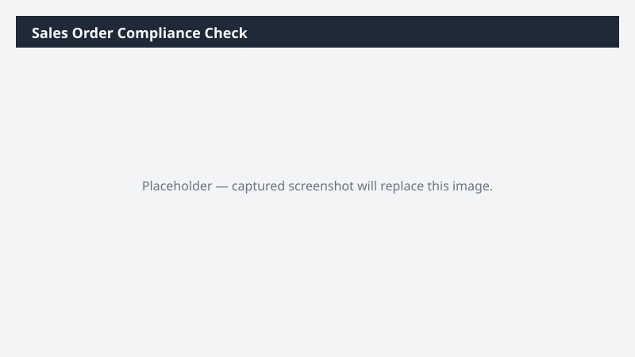

# Sales Order Compliance Check

Validates open sales orders against policy: pricing, credit, customer status, delivery terms.

> ⚠ **Draft recipe — not yet verified.** The prompt, OOTB skill list, and plugin actions named below are starter content. No one has run this against a live Cowork tenant with the Dynamics 365 ERP plugin yet. Plugin action ids may not match Microsoft's actual published surface. Validate before relying on it.

## What it does

Pre-shipment policy check on the sales-order book.

## Prerequisites

- Dynamics 365 F&SCM access with the Sales role

## Step-by-step

1. Paste the prompt.
2. Resolve flagged orders in D365 before shipping.

## Expected output

Workbook of out-of-policy sales orders by category.

## Skills used

OOTB: Excel
Plugin actions: dynamics-365-erp/sales-order-query

## License

CC-BY-4.0 — see repo `LICENSE`.
