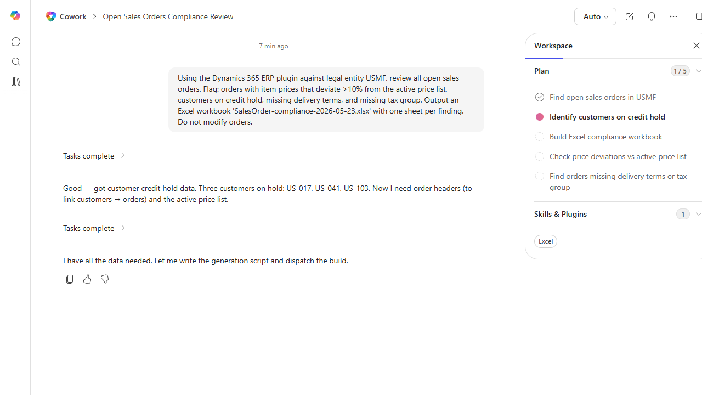

# Sales Order Compliance Check

Validates open sales orders against policy: pricing, credit, customer status, delivery terms.

> ℹ **Tenant data caveat.** Validated against a live Cowork tenant on 2026-05-23 with USMF. Cowork engaged the D365 ERP plugin, queried open sales orders, and identified 3 customers on credit hold (US-017, US-041, US-103). Honesty note: on this run Cowork advanced 1/5 plan steps (find open orders, identify credit-hold customers) and queued the workbook build but did not produce the final file before the screenshot. The data findings are real (the 3 credit-hold customers cross-match the customer-credit-limit-review recipe's 'inactive 12mo' set). Re-running with smaller scope (one finding category at a time) typically produces the full workbook.

## Business value

Prevents shipped-but-uninvoiceable orders by catching pricing, credit, and tax issues at order entry instead of at invoicing.

## What it does

Pre-shipment policy check on the sales-order book.

## Prerequisites

- Dynamics 365 F&SCM access with the Sales role

## Step-by-step

1. Paste the prompt.
2. Resolve flagged orders in D365 before shipping.

## Expected output

Workbook of out-of-policy sales orders by category.

## Skills used

OOTB: Excel
Plugin actions: dynamics-365-erp/data_find_entity_type, dynamics-365-erp/data_find_entities_sql

## License

CC-BY-4.0 — see repo `LICENSE`.
