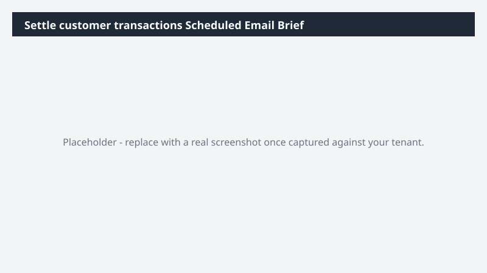

# Settle customer transactions Scheduled Email Brief

Schedulable morning-brief email summarizing settle customer transactions for the responsible owner; designed to run daily or weekly.

> ⚠ **Draft recipe — not yet verified.** Generated by the bulk catalog generator to ensure every Business Process Catalog process has at least one recipe. The prompt below uses the real D365 ERP MCP tool surface and the USMF tenant data conventions, but no one has run this against a live Cowork tenant yet. Validate before relying on it.

## Business value

Replaces a daily manual spreadsheet stitch with an automatic brief so owners walk into standup already knowing where settle customer transactions stands.

## What it does

Reads settle customer transactions, computes a short brief, drafts an email, and is a strong candidate for a Cowork scheduled task.

## Prerequisites

- Dynamics 365 F&SCM access with the appropriate role
- Cowork D365 ERP plugin enabled

## Step-by-step

1. Open Cowork and confirm the Dynamics 365 ERP plugin is toggled on for your session.
2. Paste the prompt from `prompt.md` into a new task.
3. Review the generated output and adjust scope as needed.

## Expected output

See the prompt for the specific deliverable(s). All generated files land in `Documents/Cowork/output/` in OneDrive.

## Skills used

OOTB: Email, Communications
Plugin actions: dynamics-365-erp/data_find_entity_type, dynamics-365-erp/data_find_entities_sql

## License

CC-BY-4.0 — see repo `LICENSE`.
