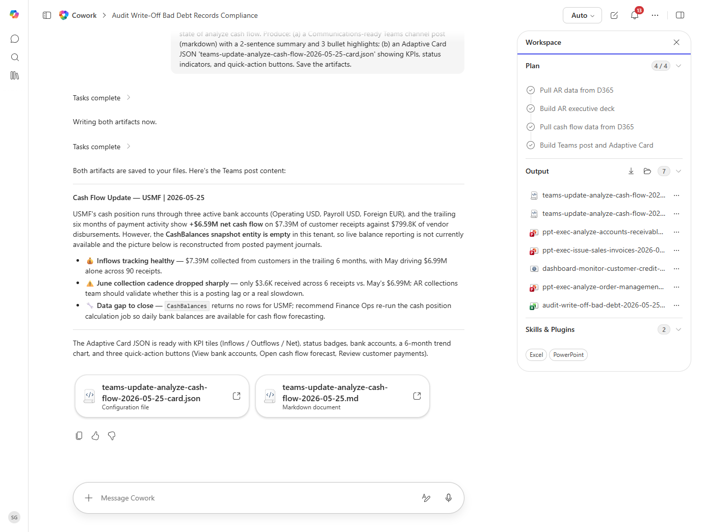

# Analyze cash flow Teams Channel Update

Drafts a Teams channel post on analyze cash flow status with an interactive Adaptive Card for quick triage.

## Business value

Replaces 'check the spreadsheet' Teams pings with a glanceable card the team can act on directly - reducing back-and-forth and decision latency.

## What it does

Reads analyze cash flow, produces a Communications-ready Teams post + an Adaptive Card with quick-action buttons.

## Prerequisites

- Dynamics 365 F&SCM access with the appropriate role
- Cowork D365 ERP plugin enabled

## Step-by-step

1. Open Cowork and confirm the Dynamics 365 ERP plugin is toggled on for your session.
2. Paste the prompt from `prompt.md` into a new task.
3. Review the generated output and adjust scope as needed.

## Expected output

See the prompt for the specific deliverable(s). All generated files land in `Documents/Cowork/output/` in OneDrive.

## Skills used

OOTB: Communications, Adaptive Cards
Plugin actions: dynamics-365-erp/data_find_entity_type, dynamics-365-erp/data_find_entities_sql

## License

CC-BY-4.0 — see repo `LICENSE`.
