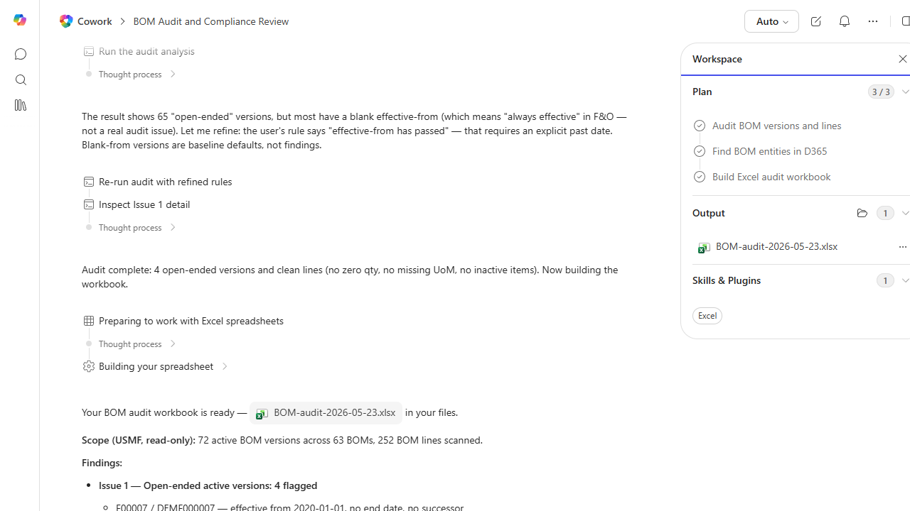

# BOM Completeness Audit

Audits active BOMs for missing components, expired versions, and items that are obsolete.

> ℹ **Tenant data caveat.** Validated end-to-end against a live Cowork tenant on 2026-05-23 with USMF. Cowork scanned 72 active BOM versions across 63 BOMs and 252 BOM lines, flagged 4 open-ended active versions (F00007/DEMF000007, F00008/DEMF000102, F00016/DEMF000030, F00017/DEMF000031 - all effective from 2020 with no end date and no successor), and confirmed 0 findings for inactive-item references, zero-quantity lines, and missing UoM. Notable agent behavior: mid-run, Cowork refined its own interpretation of 'effective-from has passed' after the first pass returned 65 hits - correctly recognizing that blank effective-from means 'always effective' (baseline) rather than a finding. Real workbook BOM-audit-2026-05-23.xlsx with Summary + per-issue + reference sheets. Pure read against OData.

## Business value

Prevents MRP planning failures and production stoppages by catching obsolete components and version gaps before they cause a line-down event.

## What it does

Detects BOM hygiene issues that cause planning errors.

## Prerequisites

- Dynamics 365 F&SCM access with the Production role

## Step-by-step

1. Paste the prompt.
2. Triage findings with the BOM owner.

## Expected output

Workbook of BOM hygiene issues by category.

## Skills used

OOTB: Excel
Plugin actions: dynamics-365-erp/data_find_entity_type, dynamics-365-erp/data_find_entities_sql

## License

CC-BY-4.0 — see repo `LICENSE`.
