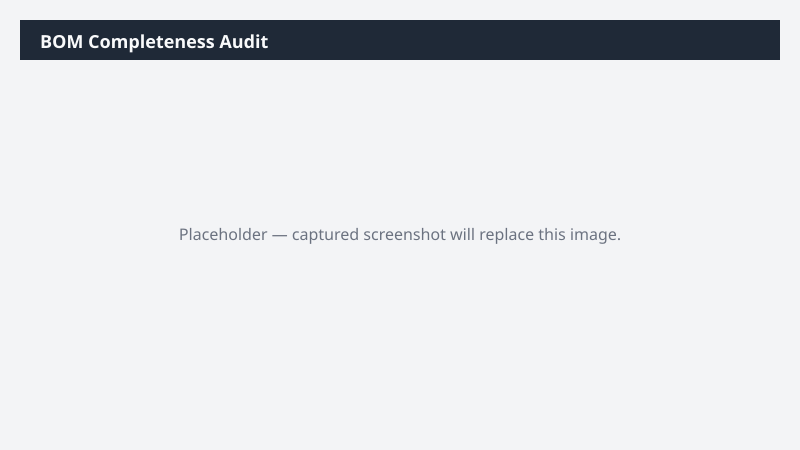

# BOM Completeness Audit

Audits active BOMs for missing components, expired versions, and items that are obsolete.

> ⚠ **Draft recipe — not yet verified.** The prompt, OOTB skill list, and plugin actions named below are starter content. No one has run this against a live Cowork tenant with the Dynamics 365 ERP plugin yet. Validate before relying on it.

## Business value

Prevents MRP planning failures and production stoppages by catching obsolete components and version gaps before they cause a line-down event.

## What it does

Detects BOM hygiene issues that cause planning errors.

## Prerequisites

- Dynamics 365 F&SCM access with the Production role

## Step-by-step

1. Paste the prompt.
2. Triage findings with the BOM owner.

## Expected output

Workbook of BOM hygiene issues by category.

## Skills used

OOTB: Excel
Plugin actions: dynamics-365-erp/data_find_entity_type, dynamics-365-erp/data_find_entities_sql

## License

CC-BY-4.0 — see repo `LICENSE`.
