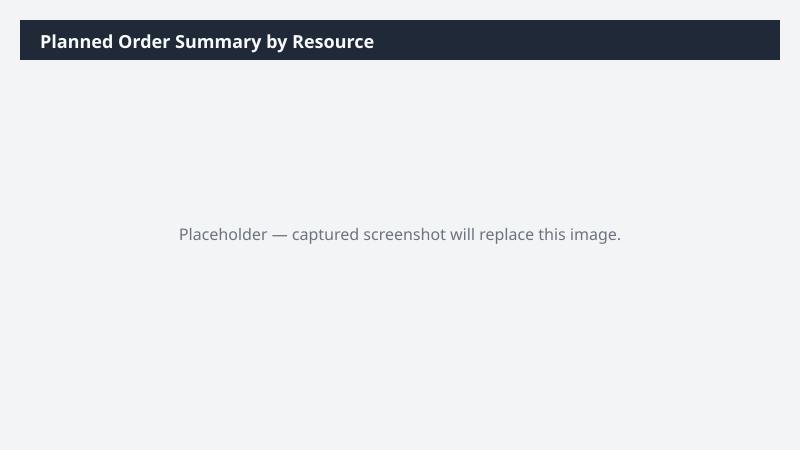

# Planned Order Summary by Resource

Summarizes planned production orders by resource for the next four weeks, including load vs capacity.

## What it does

Capacity-and-load view of the planned production schedule.

## Prerequisites

- Dynamics 365 F&SCM access with the Production role

## Step-by-step

1. Paste the prompt.
2. Use the workbook in production planning meetings.

## Expected output

Workbook with data + summary sheet.

## Skills used

OOTB: Excel
Plugin actions: dynamics-365-erp/bom-query

## License

CC-BY-4.0 — see repo `LICENSE`.
