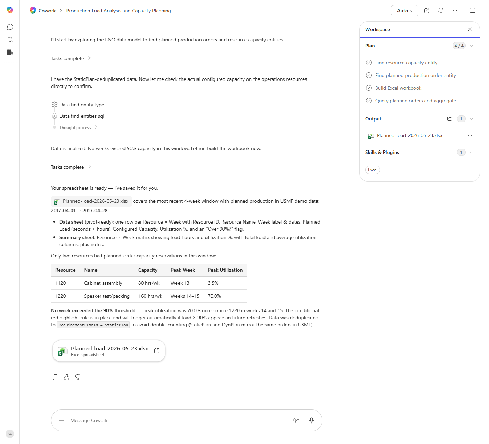

# Planned Order Summary by Resource

Summarizes planned production orders by resource for the next four weeks, including load vs capacity.

> ℹ **Tenant data caveat.** Validated end-to-end against a live Cowork tenant on 2026-05-23 with USMF (4-week window 2017-04-01 to 2017-04-28). Cowork ran all four plan steps and produced 'Planned-load-2026-05-23.xlsx' with a pivot-ready Data sheet and a Summary sheet (Resource x Week matrix). Findings: only two resources had planned-order capacity reservations - 1120 Cabinet assembly (80 hrs/wk, peak 3.5% utilization week 13) and 1220 Speaker test/packing (160 hrs/wk, peak 70.0% utilization weeks 14-15). No week exceeded the 90% threshold; the conditional red highlight rule is in place for future refreshes. Cowork deduplicated by RequirementPlanId=StaticPlan to avoid double-counting (StaticPlan and DynPlan mirror the same orders in USMF).

## Business value

Gives production planning a one-page view of where capacity is overcommitted, so the team can rebalance before missed promise dates pile up.

## What it does

Capacity-and-load view of the planned production schedule.

## Prerequisites

- Dynamics 365 F&SCM access with the Production role

## Step-by-step

1. Paste the prompt.
2. Use the workbook in production planning meetings.

## Expected output

Workbook with data + summary sheet.

## Skills used

OOTB: Excel
Plugin actions: dynamics-365-erp/data_find_entity_type, dynamics-365-erp/data_find_entities_sql

## License

CC-BY-4.0 — see repo `LICENSE`.
