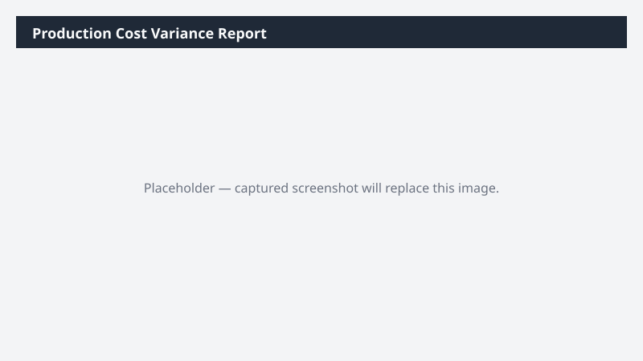

# Production Cost Variance Report

Compares standard cost to actual cost on completed production orders and highlights material variances.

## What it does

Quantifies and flags production cost variance for completed orders.

## Prerequisites

- Dynamics 365 F&SCM access with the Production role

## Step-by-step

1. Paste the prompt.
2. Review with the production controller.

## Expected output

Workbook with variances by category.

## Skills used

OOTB: Excel
Plugin actions: dynamics-365-erp/bom-query

## License

CC-BY-4.0 — see repo `LICENSE`.
