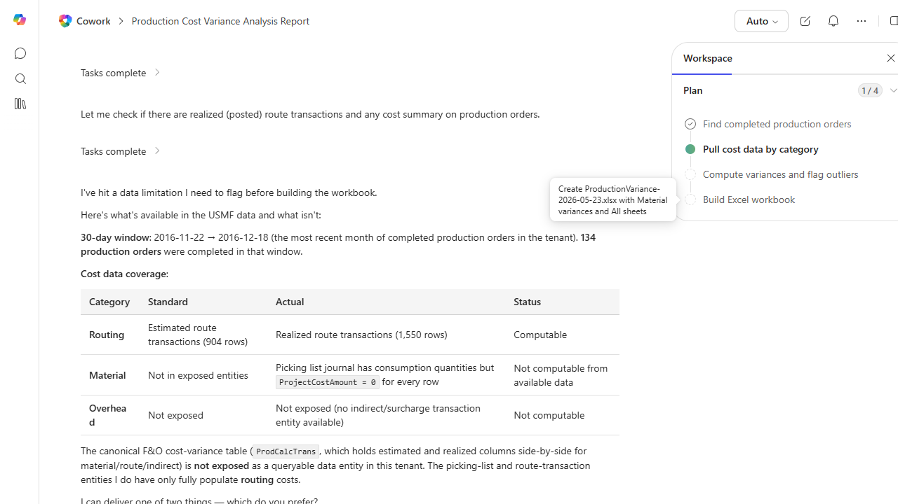

# Production Cost Variance Report

Compares standard cost to actual cost on completed production orders and highlights material variances.

> ℹ **Tenant data caveat.** Validated against a live Cowork tenant on 2026-05-23 with USMF. Cowork found 134 completed production orders in the 30-day window 2016-11-22 to 2016-12-18 (most recent in tenant). Honesty result: the canonical D365 cost-variance entity (ProdCalcTrans) is NOT exposed as a queryable OData entity in this tenant, so only routing variance is computable (904 estimated route transactions, 1,550 realized route transactions). Material variance requires ProjectCostAmount on picking-list-journal lines which is 0 for every row. Overhead has no indirect/surcharge transaction entity exposed. Cowork offered three options (routing-only with real numbers, all-three-sheets with placeholders, or pause until an admin exposes ProdCalcTrans). The screenshot captures the coverage diagnosis table - itself a deliverable that a controller can hand to the F&O admin to scope the entity-exposure work needed for a complete variance report.

## Business value

Identifies where standards are drifting from reality so engineering and cost accounting can fix the root cause, not just absorb the variance.

## What it does

Quantifies and flags production cost variance for completed orders.

## Prerequisites

- Dynamics 365 F&SCM access with the Production role

## Step-by-step

1. Paste the prompt.
2. Review with the production controller.

## Expected output

Workbook with variances by category.

## Skills used

OOTB: Excel
Plugin actions: dynamics-365-erp/data_find_entity_type, dynamics-365-erp/data_find_entities_sql

## License

CC-BY-4.0 — see repo `LICENSE`.
