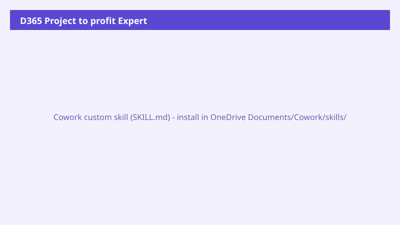

# D365 Project to profit Expert

A Dynamics 365 Finance & Supply Chain Management expert scoped to the Project to profit end-to-end process - covers 6 L2 areas and 37 L3 processes from the Microsoft Business Process Catalog.

> ℹ **This is a Cowork custom skill.** Place the contents of the `skill/` folder under `Documents/Cowork/skills/d365-project-to-profit/` in your OneDrive. Cowork auto-discovers custom skills at the start of each conversation.

## Business value

Save time and improve accuracy by giving Cowork a persistent expert context for the target domain - it knows the right entities, the USMF tenant data quirks, and the honest-degrade options before you even open a task.

## How to install

1. Open OneDrive in your browser or sync client.
2. Navigate to `/Documents/Cowork/skills/` (create the folder if it doesn't exist).
3. Create a subfolder named `d365-project-to-profit`.
4. Download `skill/SKILL.md` from this recipe and place it inside the subfolder.
5. Start a new Cowork task - the skill is auto-loaded.

## How to use

Once the skill is installed, the bootstrap prompt below activates it for a single conversation:

## Skill contents

The skill file is in `skill/SKILL.md`. It includes:

- The real 22-tool D365 ERP MCP surface (data / form / action tools)
- USMF tenant data conventions (date eras, known entity gaps)
- Honest-degrade defaults so the agent stops instead of fabricating

## License

CC-BY-4.0 - see repo `LICENSE`.
