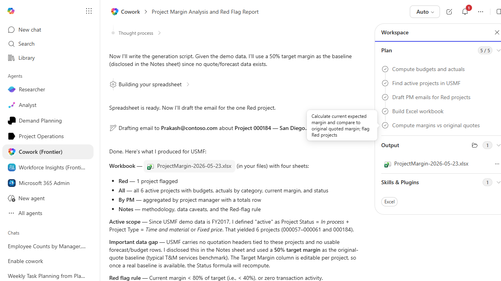

# Project Margin Health Report

Compares project budget to actuals by cost category, flags projects with margin erosion, and drafts emails to the project managers of red projects.

> ℹ **Tenant data caveat.** Validated end-to-end against a live Cowork tenant on 2026-05-23 with USMF. Cowork scoped 'active' to Project Status = In process + Project Type = Time and material or Fixed price, yielding 6 projects (000057-000061 + 000184). Real workbook ProjectMargin-2026-05-23.xlsx with Red / All / By PM / Notes sheets, and an email draft saved to Outlook (not sent) to Prakash@contoso.com about the one Red project: 000184 San Diego Subscriptions ('In process' but zero posted transactions, PM Prakash Kovvuru). Honesty notes: USMF carries no quotation headers tied to these projects so Cowork used a 50% target margin as the original-quote baseline (typical T&M services benchmark), with the Target Margin column editable per project; 5 of 6 active projects have no PM assigned in F&O; all Fee transactions in this demo carry $0 cost.

## Business value

Catches project margin erosion mid-flight (instead of at close-out), so project managers can act on overruns while there is still time to negotiate a change order or replan.

## What it does

Identifies projects with margin erosion and routes specific overrun information to the responsible PM.

## Prerequisites

- Dynamics 365 F&SCM access with the Project manager role
- Cowork D365 ERP plugin enabled

## Step-by-step

1. Paste the prompt.
2. Review the workbook; release the email drafts after personalizing tone.

## Expected output

Workbook with red/all/by-PM project margin sheets and one email draft per Red project.

## Skills used

OOTB: Excel, Email
Plugin actions: dynamics-365-erp/data_find_entity_type, dynamics-365-erp/data_find_entities_sql

## License

CC-BY-4.0 — see repo `LICENSE`.
