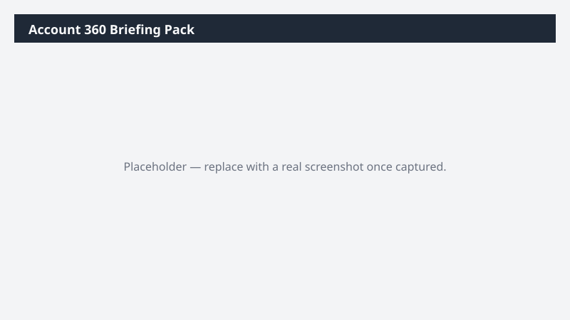

# Account 360 Briefing Pack

Assembles everything Dynamics 365 Sales knows about a named account into a single briefing document you can read before a meeting.

> ⚠ **Draft recipe — not yet verified.** No one has run this against a live Cowork tenant, and the Dataverse table and column names it relies on are taken from Microsoft documentation rather than confirmed against a live environment. The prompt tells Cowork to confirm the schema at runtime before querying, so a mismatch should surface as a correction rather than a wrong answer — but validate before relying on it.

## Business value

Replaces fifteen minutes of clicking through related-record tabs with a single document. Sellers walk into customer conversations with the full relationship history rather than whatever they could skim on the way in.

## What it does

Traverses the account's related records and composes them into a readable narrative brief. The
no-guessing rule on account matching prevents a briefing on the wrong customer.

## Prerequisites

- A Dynamics 365 Sales licence and access to a Dynamics 365 Sales environment
- The Dynamics 365 Sales plugin enabled in your Cowork session (+ > Customize > Dynamics 365 Sales)
- The plugin bound to the environment you want to analyze (gear icon on the plugin tile)

## Step-by-step

1. Confirm the **Dynamics 365 Sales** plugin is on and bound to the right environment.
2. Edit the `ACCOUNT:` line in the prompt to name the account you want.
3. Paste the prompt into a new task and send it.
4. If Cowork returns a list of close matches instead of a brief, pick one and re-run with the
   exact name.

## Expected output

A Word document of roughly two to three pages, opening with a short summary and then the
detailed sections. Length scales with how much history the account actually has.

## Portability

This recipe names no company, environment, or date range. It scopes to the records you own, discovers the Dataverse schema at runtime, and derives its analysis window from the data it finds — so it behaves the same in a trial environment as in a large production org.

## Skills used

OOTB: Word, Excel

Plugin actions: dynamics-365-sales/search, dynamics-365-sales/describe, dynamics-365-sales/read_query

## License

CC-BY-4.0 — see repo `LICENSE`.
