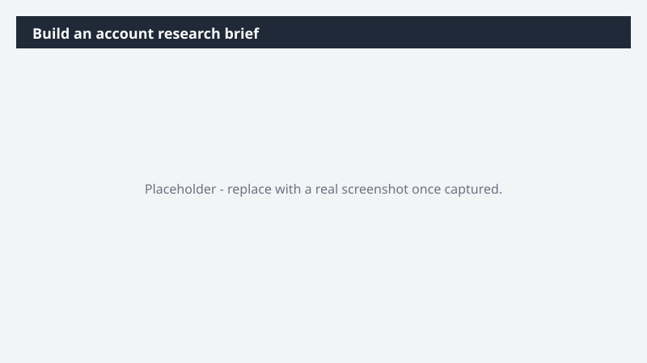

# Build an account research brief

Walk into account planning already knowing the shape of the opportunity - pipeline, stakeholders, recent activity, and where the deal sits - without piecing it together from CRM tabs.

> ⚠ **Draft recipe — not yet verified.** This prompt is reproduced from the Microsoft Copilot Cowork Task Pack for Sales. It has not been run against our tenant, so the output described below is the pack's stated expectation rather than an observed result. Validate before relying on it.

## Business value

Walk into account planning already knowing the shape of the opportunity - pipeline, stakeholders, recent activity, and where the deal sits - without piecing it together from CRM tabs. A Word account research brief - opportunity overview, key contacts, recent engagement signals, and active pipeline - built directly from Dynamics 365 Sales data and grounded in your Microsoft 365 work history.

## What it does

A Word account research brief - opportunity overview, key contacts, recent engagement signals, and active pipeline - built directly from Dynamics 365 Sales data and grounded in your Microsoft 365 work history.

## Prerequisites

- Microsoft 365 Copilot licence with access to Cowork
- Dynamics 365 Sales plugin enabled in your Cowork session, bound to your CRM environment
- A Dynamics 365 Sales licence

## Step-by-step

1. Open Cowork and start a new task.
2. Confirm the required plugin is turned on under **+ > Customize**: Dynamics 365 Sales plugin enabled in your Cowork session, bound to your CRM environment.
3. Paste the prompt from `prompt.md`, replacing anything in square brackets with your own values.
4. Review the plan Cowork proposes before letting it run.
5. Check any drafted email or calendar change before approving it — the prompt holds them for review rather than sending.

## How Cowork works through it

1. Dynamics 365 Sales → Pull opportunity, contacts, pipeline
2. Email + Meetings + Teams → Capture engagement signals
3. Synthesize → Account state + customer sentiment
4. Identify → Risks, opportunities, open threads
5. Word → Account research brief
6. Deliver → Word account research brief

## Expected output

A Word account research brief - opportunity overview, key contacts, recent engagement signals, and active pipeline - built directly from Dynamics 365 Sales data and grounded in your Microsoft 365 work history.

## Source

Adapted from the **Microsoft Copilot Cowork Task Pack for Sales**, a task pack Microsoft publishes for customers. The prompt is reproduced as published; the surrounding recipe metadata, process tagging, and guidance are the Cookbook's.

## Skills used

OOTB: Word, Email, Meetings, Communications

Plugin: dynamics-365-sales

## License

CC-BY-4.0 — see repo `LICENSE`.
