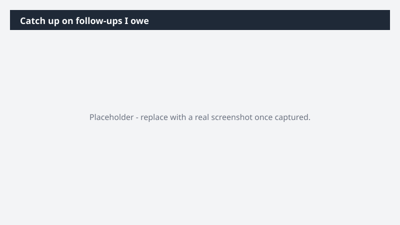

# Catch up on follow-ups I owe

Close the loop on every contact you met but never circled back to.

> ⚠ **Draft recipe — not yet verified.** This prompt is reproduced from the Microsoft Copilot Cowork Task Pack for Sales. It has not been run against our tenant, so the output described below is the pack's stated expectation rather than an observed result. Validate before relying on it.

## Business value

Close the loop on every contact you met but never circled back to. A list of un-re-engaged contacts with a drafted, personalized follow-up for each.

## What it does

A list of un-re-engaged contacts with a drafted, personalized follow-up for each.

## Prerequisites

- Microsoft 365 Copilot licence with access to Cowork
- Dynamics 365 Sales plugin enabled in your Cowork session, bound to your CRM environment
- A Dynamics 365 Sales licence

## Step-by-step

1. Open Cowork and start a new task.
2. Confirm the required plugin is turned on under **+ > Customize**: Dynamics 365 Sales plugin enabled in your Cowork session, bound to your CRM environment.
3. Paste the prompt from `prompt.md`, replacing anything in square brackets with your own values.
4. Review the plan Cowork proposes before letting it run.
5. Check any drafted email or calendar change before approving it — the prompt holds them for review rather than sending.

## How Cowork works through it

1. Calendar → List every contact met last week
2. Email + Dynamics 365 Sales → Flag contacts with no follow-up logged
3. Draft → Personalized follow-up email per contact
4. Hold → Drafts staged in Outlook for review

## Expected output

A list of un-re-engaged contacts with a drafted, personalized follow-up for each.

## Source

Adapted from the **Microsoft Copilot Cowork Task Pack for Sales**, a task pack Microsoft publishes for customers. The prompt is reproduced as published; the surrounding recipe metadata, process tagging, and guidance are the Cookbook's.

## Skills used

OOTB: Email, Calendar Management

Plugin: dynamics-365-sales

## License

CC-BY-4.0 — see repo `LICENSE`.
