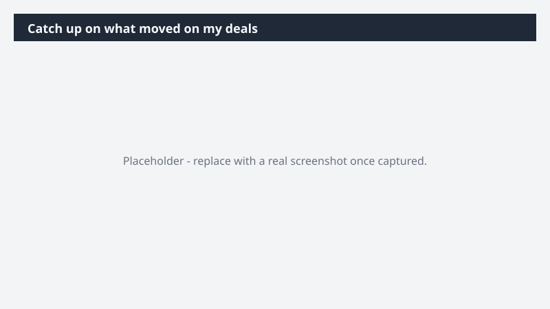

# Catch up on what moved on my deals

Know what changed across your top deals without reading back through a week of threads.

> ⚠ **Draft recipe — not yet verified.** This prompt is reproduced from the Microsoft Copilot Cowork Task Pack for Sales. It has not been run against our tenant, so the output described below is the pack's stated expectation rather than an observed result. Validate before relying on it.

## Business value

Know what changed across your top deals without reading back through a week of threads. A per-deal change readout across your top opportunities, fusing CRM movement with communication signals.

## What it does

A per-deal change readout across your top opportunities, fusing CRM movement with communication signals.

## Prerequisites

- Microsoft 365 Copilot licence with access to Cowork
- Dynamics 365 Sales plugin enabled in your Cowork session, bound to your CRM environment
- A Dynamics 365 Sales licence

## Step-by-step

1. Open Cowork and start a new task.
2. Confirm the required plugin is turned on under **+ > Customize**: Dynamics 365 Sales plugin enabled in your Cowork session, bound to your CRM environment.
3. Paste the prompt from `prompt.md`, replacing anything in square brackets with your own values.
4. Review the plan Cowork proposes before letting it run.
5. Check any drafted email or calendar change before approving it — the prompt holds them for review rather than sending.

## How Cowork works through it

1. Dynamics 365 Sales → Pull current state on top 5 opportunities
2. Email + Meetings + Teams → Capture engagement signals per deal
3. Compare → Flag what moved, what stalled, and where a customer went quiet
4. Deliver → Per-deal change readout, scannable in two minutes

## Expected output

A per-deal change readout across your top opportunities, fusing CRM movement with communication signals.

## Source

Adapted from the **Microsoft Copilot Cowork Task Pack for Sales**, a task pack Microsoft publishes for customers. The prompt is reproduced as published; the surrounding recipe metadata, process tagging, and guidance are the Cookbook's.

## Skills used

OOTB: Email, Meetings, Communications

Plugin: dynamics-365-sales

## License

CC-BY-4.0 — see repo `LICENSE`.
