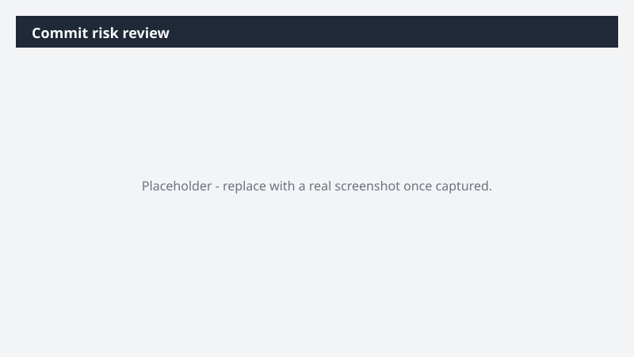

# Commit risk review

Know which Commit deals are at risk before quarter-end - with follow-ups drafted and CRM updated.

> ⚠ **Draft recipe — not yet verified.** This prompt is reproduced from the Microsoft Copilot Cowork Task Pack for Sales. It has not been run against our tenant, so the output described below is the pack's stated expectation rather than an observed result. Validate before relying on it.

> **Tip.** Note: This Task runs on an uploaded CRM snapshot. For live data, the Dynamics 365 Sales plugin is optional but recommended - it lets Cowork pull these opportunities directly from your CRM instead of a static export.

## Business value

Know which Commit deals are at risk before quarter-end - with follow-ups drafted and CRM updated. A one-page PowerPoint risk summary, a targeted follow-up email per at-risk deal, and a CRM update file with risk flags and dated follow-up tasks

## What it does

A one-page PowerPoint risk summary, a targeted follow-up email per at-risk deal, and a CRM update file with risk flags and dated follow-up tasks

## Prerequisites

- Microsoft 365 Copilot licence with access to Cowork
- Dynamics 365 Sales plugin enabled in your Cowork session, bound to your CRM environment
- A Dynamics 365 Sales licence

## Step-by-step

1. Open Cowork and start a new task.
2. Confirm the required plugin is turned on under **+ > Customize**: Dynamics 365 Sales plugin enabled in your Cowork session, bound to your CRM environment.
3. Paste the prompt from `prompt.md`, replacing anything in square brackets with your own values.
4. Review the plan Cowork proposes before letting it run.
5. Check any drafted email or calendar change before approving it — the prompt holds them for review rather than sending.

## How Cowork works through it

1. [CRM Snapshot] or Dynamics 365 Sales → Pull Commit opportunities closing this quarter
2. Email + Meetings + Files → Cross-check customer engagement signals per deal
3. Analyze → Identify risk pattern per opportunity
4. PowerPoint → One-page at-risk deal summary slide
5. Draft Email → Targeted follow-up email per at-risk deal
6. Excel → CRM update file (risk flags + follow-up tasks with due dates)
7. Deliver → Risk summary · follow-ups · CRM update

## Expected output

A one-page PowerPoint risk summary, a targeted follow-up email per at-risk deal, and a CRM update file with risk flags and dated follow-up tasks

## Source

Adapted from the **Microsoft Copilot Cowork Task Pack for Sales**, a task pack Microsoft publishes for customers. The prompt is reproduced as published; the surrounding recipe metadata, process tagging, and guidance are the Cookbook's.

## Skills used

OOTB: Excel, PowerPoint, Email, Meetings

Plugin: dynamics-365-sales

## License

CC-BY-4.0 — see repo `LICENSE`.
