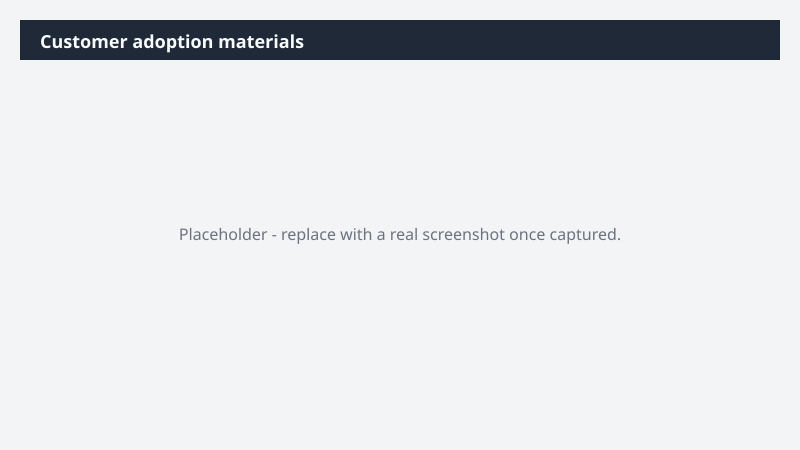

# Customer adoption materials

Build a role-relevant learning curriculum for a customer - structured, sourced, and deployment-ready.

> ⚠ **Draft recipe — not yet verified.** This prompt is reproduced from the Microsoft Copilot Cowork Task Pack for Sales. It has not been run against our tenant, so the output described below is the pack's stated expectation rather than an observed result. Validate before relying on it.

## Business value

Build a role-relevant learning curriculum for a customer - structured, sourced, and deployment-ready. A full Markdown curriculum with three progressive learning paths (Beginner, Intermediate, Advanced) - each with sequenced resource tables, persona-tailored application notes, and a recommended rollout order for the customer's champion or power-user program.

## What it does

A full Markdown curriculum with three progressive learning paths (Beginner, Intermediate, Advanced) - each with sequenced resource tables, persona-tailored application notes, and a recommended rollout order for the customer's champion or power-user program.

## Prerequisites

- Microsoft 365 Copilot licence with access to Cowork

## Step-by-step

1. Open Cowork and start a new task.
2. Paste the prompt from `prompt.md`, replacing anything in square brackets with your own values.
3. Review the plan Cowork proposes before letting it run.
4. Check any drafted email or calendar change before approving it — the prompt holds them for review rather than sending.

## How Cowork works through it

1. Q&A → Gather customer context (user base · program type · skill gaps)
2. Web → Research public [Product Vendor] training resources
3. Validate → Official sources only · no internal or tenant-specific content
4. Structure → Three progressive learning paths (Beginner · Intermediate · Advanced)
5. Build → Sequenced resource table per level
6. Tailor → Call out [Customer Role/Persona] application per skill
7. Close → Rollout order + champion program deployment recommendations
8. Deliver → Full curriculum in Markdown

## Expected output

A full Markdown curriculum with three progressive learning paths (Beginner, Intermediate, Advanced) - each with sequenced resource tables, persona-tailored application notes, and a recommended rollout order for the customer's champion or power-user program.

## Source

Adapted from the **Microsoft Copilot Cowork Task Pack for Sales**, a task pack Microsoft publishes for customers. The prompt is reproduced as published; the surrounding recipe metadata, process tagging, and guidance are the Cookbook's.

## Skills used

OOTB: PowerPoint

Plugin: none required

## License

CC-BY-4.0 — see repo `LICENSE`.
