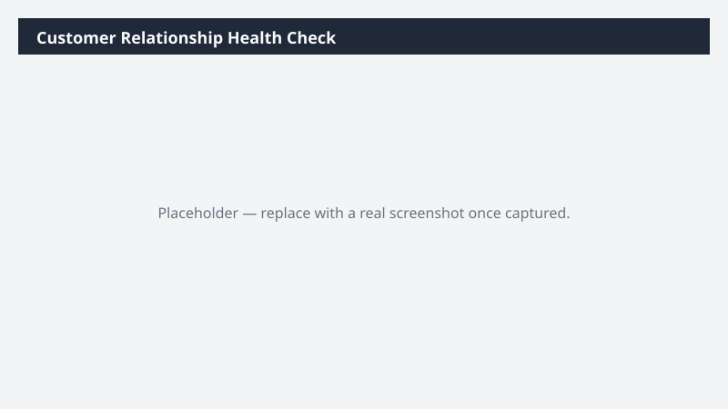

# Customer Relationship Health Check

Scores the accounts you own for relationship health using contact coverage, engagement recency, and open-pipeline signals.

> ⚠ **Draft recipe — not yet verified.** No one has run this against a live Cowork tenant, and the Dataverse table and column names it relies on are taken from Microsoft documentation rather than confirmed against a live environment. The prompt tells Cowork to confirm the schema at runtime before querying, so a mismatch should surface as a correction rather than a wrong answer — but validate before relying on it.

## Business value

Single-threaded and quietly dormant accounts are the ones that churn or get lost to a competitor without warning. This finds them while there is still time to build coverage.

## What it does

Builds a composite health rating from four objective signals and makes the scoring rule explicit
so it can be argued with and tuned. The single-threading view is broken out separately because
it is the most actionable.

## Prerequisites

- A Dynamics 365 Sales licence and access to a Dynamics 365 Sales environment
- The Dynamics 365 Sales plugin enabled in your Cowork session (+ > Customize > Dynamics 365 Sales)
- The plugin bound to the environment you want to analyze (gear icon on the plugin tile)

## Step-by-step

1. Confirm the **Dynamics 365 Sales** plugin is on and bound to the right environment.
2. Paste the prompt from `prompt.md` and send it.
3. Read the stated scoring rule before reading the ratings, and adjust the prompt if the
   weighting does not match how your business thinks about coverage.

## Expected output

A three-sheet workbook with an explicit scoring rule stated in the output. The Single-Threaded
sheet is typically the one that drives immediate action.

## Portability

This recipe names no company, environment, or date range. It scopes to the records you own, discovers the Dataverse schema at runtime, and derives its analysis window from the data it finds — so it behaves the same in a trial environment as in a large production org.

## Skills used

OOTB: Excel

Plugin actions: dynamics-365-sales/search, dynamics-365-sales/describe, dynamics-365-sales/read_query

## License

CC-BY-4.0 — see repo `LICENSE`.
