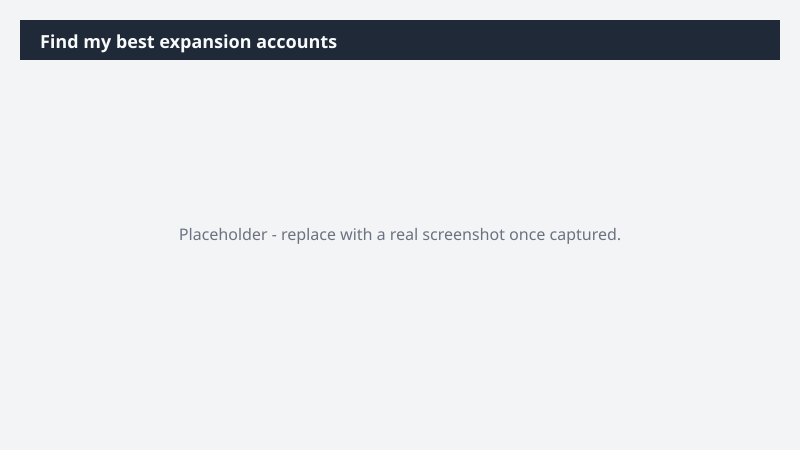

# Find my best expansion accounts

Surface the accounts most likely to grow - and arrive at each one with the expansion case already built.

> ⚠ **Draft recipe — not yet verified.** This prompt is reproduced from the Microsoft Copilot Cowork Task Pack for Sales. It has not been run against our tenant, so the output described below is the pack's stated expectation rather than an observed result. Validate before relying on it.

> **Tip.** Note: This task runs on Dynamics 365 Sales. With the Fabric IQ plugin, Cowork also reads your live revenue and consumption trends - grounding the pattern-match in real spend data, not just CRM stage.

## Business value

Surface the accounts most likely to grow - and arrive at each one with the expansion case already built. A ranked expansion shortlist plus a one-page expansion brief per top account - the spend-growth signals, the likely expansion play, and the stakeholders to engage.

## What it does

A ranked expansion shortlist plus a one-page expansion brief per top account - the spend-growth signals, the likely expansion play, and the stakeholders to engage.

## Prerequisites

- Microsoft 365 Copilot licence with access to Cowork
- Dynamics 365 Sales plugin enabled in your Cowork session, bound to your CRM environment
- A Dynamics 365 Sales licence

## Step-by-step

1. Open Cowork and start a new task.
2. Confirm the required plugin is turned on under **+ > Customize**: Dynamics 365 Sales plugin enabled in your Cowork session, bound to your CRM environment.
3. Paste the prompt from `prompt.md`, replacing anything in square brackets with your own values.
4. Review the plan Cowork proposes before letting it run.
5. Check any drafted email or calendar change before approving it — the prompt holds them for review rather than sending.

## How Cowork works through it

1. Dynamics 365 Sales → Pull account base, deal history, and stakeholders
2. Fabric IQ → Read year-over-year revenue and consumption trends
3. Analyze → Match account signals against the historical-doubler pattern
4. Rank → Order accounts by expansion likelihood with a one-line rationale
5. Deliver → Ranked expansion shortlist + one-page expansion brief for the top 3 (signals · play · stakeholders · first move)

## Expected output

A ranked expansion shortlist plus a one-page expansion brief per top account - the spend-growth signals, the likely expansion play, and the stakeholders to engage.

## Source

Adapted from the **Microsoft Copilot Cowork Task Pack for Sales**, a task pack Microsoft publishes for customers. The prompt is reproduced as published; the surrounding recipe metadata, process tagging, and guidance are the Cookbook's.

## Skills used

OOTB: Communications

Plugin: dynamics-365-sales

## License

CC-BY-4.0 — see repo `LICENSE`.
