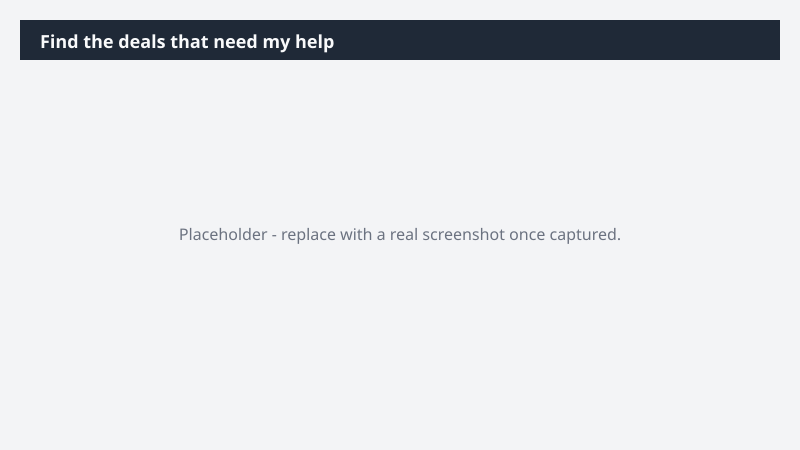

# Find the deals that need my help

Know where your attention moves the number this week - and understand why each deal is stuck, not just that it is

> ⚠ **Draft recipe — not yet verified.** This prompt is reproduced from the Microsoft Copilot Cowork Task Pack for Sales. It has not been run against our tenant, so the output described below is the pack's stated expectation rather than an observed result. Validate before relying on it.

## Business value

Know where your attention moves the number this week - and understand why each deal is stuck, not just that it is A prioritized list of team deals needing manager involvement, paired with a deep research report that digs into the at-risk opportunities - root cause, account context, and a recommended play for each.

## What it does

A prioritized list of team deals needing manager involvement, paired with a deep research report that digs into the at-risk opportunities - root cause, account context, and a recommended play for each.

## Prerequisites

- Microsoft 365 Copilot licence with access to Cowork
- Dynamics 365 Sales plugin enabled in your Cowork session, bound to your CRM environment
- A Dynamics 365 Sales licence

## Step-by-step

1. Open Cowork and start a new task.
2. Confirm the required plugin is turned on under **+ > Customize**: Dynamics 365 Sales plugin enabled in your Cowork session, bound to your CRM environment.
3. Paste the prompt from `prompt.md`, replacing anything in square brackets with your own values.
4. Review the plan Cowork proposes before letting it run.
5. Check any drafted email or calendar change before approving it — the prompt holds them for review rather than sending.

## How Cowork works through it

1. Dynamics 365 Sales → Roll up team pipeline by risk signal and activity recency
2. Analyze → Flag stalled deals, slipped close dates, and accounts gone quiet
3. Prioritize → Order deals by need for manager involvement
4. Research → Deep-dive each flagged deal - account history, root cause, recommended play
5. Deliver → Prioritized list up front, deep research report behind it

## Expected output

A prioritized list of team deals needing manager involvement, paired with a deep research report that digs into the at-risk opportunities - root cause, account context, and a recommended play for each.

## Source

Adapted from the **Microsoft Copilot Cowork Task Pack for Sales**, a task pack Microsoft publishes for customers. The prompt is reproduced as published; the surrounding recipe metadata, process tagging, and guidance are the Cookbook's.

## Skills used

OOTB: Deep Research

Plugin: dynamics-365-sales

## License

CC-BY-4.0 — see repo `LICENSE`.
