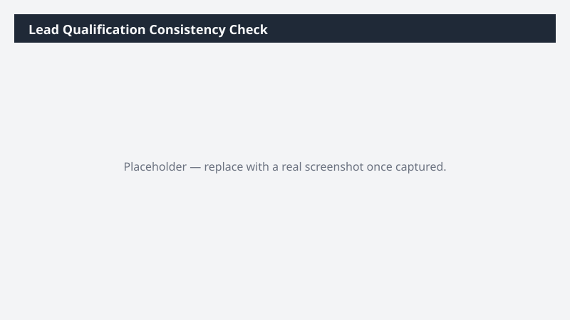

# Lead Qualification Consistency Check

Checks whether leads are being qualified and disqualified consistently, and surfaces disqualifications with missing or vague reasons.

> ⚠ **Draft recipe — not yet verified.** No one has run this against a live Cowork tenant, and the Dataverse table and column names it relies on are taken from Microsoft documentation rather than confirmed against a live environment. The prompt tells Cowork to confirm the schema at runtime before querying, so a mismatch should surface as a correction rather than a wrong answer — but validate before relying on it.

## Business value

Inconsistent qualification quietly corrupts every downstream conversion metric. This shows where the qualification bar is being applied unevenly and where disqualification reasons are too thin to learn from.

## What it does

Profiles qualification behaviour rather than lead outcomes: reason-code hygiene, missing data at
the qualification gate, per-owner outliers, and decision latency. Read-only.

## Prerequisites

- A Dynamics 365 Sales licence and access to a Dynamics 365 Sales environment
- The Dynamics 365 Sales plugin enabled in your Cowork session (+ > Customize > Dynamics 365 Sales)
- The plugin bound to the environment you want to analyze (gear icon on the plugin tile)

## Step-by-step

1. Confirm the **Dynamics 365 Sales** plugin is on and bound to the right environment.
2. Paste the prompt from `prompt.md` and send it.
3. Treat the outlier section as a conversation starter, not a verdict — territory mix explains
   many apparent outliers.

## Expected output

A multi-sheet workbook. The disqualification-reason distribution is usually the most revealing
sheet: a large 'blank or generic' bucket means your loss reasons cannot support any real
analysis yet.

## Portability

This recipe names no company, environment, or date range. It scopes to the records you own, discovers the Dataverse schema at runtime, and derives its analysis window from the data it finds — so it behaves the same in a trial environment as in a large production org.

## Skills used

OOTB: Excel

Plugin actions: dynamics-365-sales/search, dynamics-365-sales/describe, dynamics-365-sales/read_query

## License

CC-BY-4.0 — see repo `LICENSE`.
