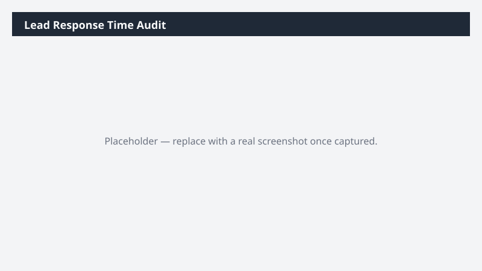

# Lead Response Time Audit

Measures how long leads wait before someone first works them, and highlights the leads that are still sitting untouched.

> ⚠ **Draft recipe — not yet verified.** No one has run this against a live Cowork tenant, and the Dataverse table and column names it relies on are taken from Microsoft documentation rather than confirmed against a live environment. The prompt tells Cowork to confirm the schema at runtime before querying, so a mismatch should surface as a correction rather than a wrong answer — but validate before relying on it.

## Business value

Speed to first contact is one of the strongest predictors of lead conversion. This makes response lag visible and specific rather than anecdotal, and surfaces the untouched backlog before it goes cold.

## What it does

Joins leads to their first recorded activity to derive response latency, then separates the
genuinely slow from the never-touched. Percentiles rather than averages, so a few outliers do
not hide the typical experience.

## Prerequisites

- A Dynamics 365 Sales licence and access to a Dynamics 365 Sales environment
- The Dynamics 365 Sales plugin enabled in your Cowork session (+ > Customize > Dynamics 365 Sales)
- The plugin bound to the environment you want to analyze (gear icon on the plugin tile)

## Step-by-step

1. Confirm the **Dynamics 365 Sales** plugin is on and bound to the right environment.
2. Paste the prompt from `prompt.md` and send it.
3. Read the Notes sheet to see whether your org records a usable first-contact signal — if not,
   Cowork will say so, and that gap is itself a finding worth acting on.

## Expected output

A four-sheet workbook. The Summary sheet is the headline: median response, 90th percentile, and
untouched count. The Untouched sheet is usually the most immediately actionable.

## Portability

This recipe names no company, environment, or date range. It scopes to the records you own, discovers the Dataverse schema at runtime, and derives its analysis window from the data it finds — so it behaves the same in a trial environment as in a large production org.

## Skills used

OOTB: Excel

Plugin actions: dynamics-365-sales/search, dynamics-365-sales/describe, dynamics-365-sales/read_query

## License

CC-BY-4.0 — see repo `LICENSE`.
