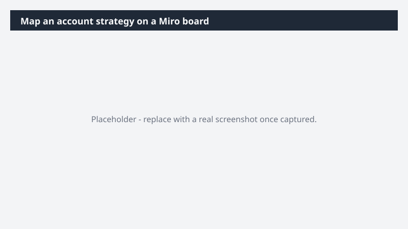

# Map an account strategy on a Miro board

Turn an account strategy conversation into a visual map the team can rally around - without spending an afternoon assembling it by hand.

> ⚠ **Draft recipe — not yet verified.** This prompt is reproduced from the Microsoft Copilot Cowork Task Pack for Sales. It has not been run against our tenant, so the output described below is the pack's stated expectation rather than an observed result. Validate before relying on it.

## Business value

Turn an account strategy conversation into a visual map the team can rally around - without spending an afternoon assembling it by hand. A Miro account strategy board - stakeholders, deal stages, key initiatives, and strategic priorities visualized in one place - paired with a tracking table the team can update as the strategy evolves.

## What it does

A Miro account strategy board - stakeholders, deal stages, key initiatives, and strategic priorities visualized in one place - paired with a tracking table the team can update as the strategy evolves.

## Prerequisites

- Microsoft 365 Copilot licence with access to Cowork
- Miro plugin enabled and connected to your workspace

## Step-by-step

1. Open Cowork and start a new task.
2. Confirm the required plugin is turned on under **+ > Customize**: Miro plugin enabled and connected to your workspace.
3. Paste the prompt from `prompt.md`, replacing anything in square brackets with your own values.
4. Review the plan Cowork proposes before letting it run.
5. Check any drafted email or calendar change before approving it — the prompt holds them for review rather than sending.

## How Cowork works through it

1. Email + Meetings + Files → Identify stakeholders + initiatives
2. Extract → Deal stages + strategic priorities
3. Structure → Account strategy framework
4. Miro → Build visual account map
5. Generate → Companion tracking table
6. Deliver → Miro account strategy board + companion tracking table

## Expected output

A Miro account strategy board - stakeholders, deal stages, key initiatives, and strategic priorities visualized in one place - paired with a tracking table the team can update as the strategy evolves.

## Source

Adapted from the **Microsoft Copilot Cowork Task Pack for Sales**, a task pack Microsoft publishes for customers. The prompt is reproduced as published; the surrounding recipe metadata, process tagging, and guidance are the Cookbook's.

## Skills used

OOTB: Email, Meetings, Communications

Plugin: miro

## License

CC-BY-4.0 — see repo `LICENSE`.
