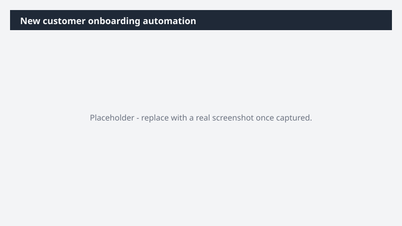

# New customer onboarding automation

Close a new customer and trigger the full onboarding sequence in one prompt.

> ⚠ **Draft recipe — not yet verified.** This prompt is reproduced from the Microsoft Copilot Cowork Task Pack for Sales. It has not been run against our tenant, so the output described below is the pack's stated expectation rather than an observed result. Validate before relying on it.

> **Tip.** Note: This is a 6-step orchestration across Email, Web, SharePoint, PowerPoint, Word, Teams, and Outlook. The welcome email is held as a draft for your review before it goes out.

## Business value

Close a new customer and trigger the full onboarding sequence in one prompt. A SharePoint folder, executive onboarding artifacts (PowerPoint + Word), a Teams message to the account team, and a welcome email draft - all triggered from a single new-customer email.

## What it does

A SharePoint folder, executive onboarding artifacts (PowerPoint + Word), a Teams message to the account team, and a welcome email draft - all triggered from a single new-customer email.

## Prerequisites

- Microsoft 365 Copilot licence with access to Cowork

## Step-by-step

1. Open Cowork and start a new task.
2. Paste the prompt from `prompt.md`, replacing anything in square brackets with your own values.
3. Review the plan Cowork proposes before letting it run.
4. Check any drafted email or calendar change before approving it — the prompt holds them for review rather than sending.

## How Cowork works through it

1. Email inbox → Locate "NEW CUSTOMER" email as source of truth
2. Web → Research [Customer Name] location · industry · revenue
3. SharePoint → Create "YYYY-MM-DD [Customer Name]" folder
4. PowerPoint + Word → Build executive onboarding artifacts in folder
5. Teams → Message [Account Team Members] with summary + folder link
6. Draft → Welcome email to [Customer Contact Name] (held for review)

## Expected output

A SharePoint folder, executive onboarding artifacts (PowerPoint + Word), a Teams message to the account team, and a welcome email draft - all triggered from a single new-customer email.

## Source

Adapted from the **Microsoft Copilot Cowork Task Pack for Sales**, a task pack Microsoft publishes for customers. The prompt is reproduced as published; the surrounding recipe metadata, process tagging, and guidance are the Cookbook's.

## Skills used

OOTB: Word, PowerPoint, Email, Communications, Enterprise Search

Plugin: none required

## License

CC-BY-4.0 — see repo `LICENSE`.
