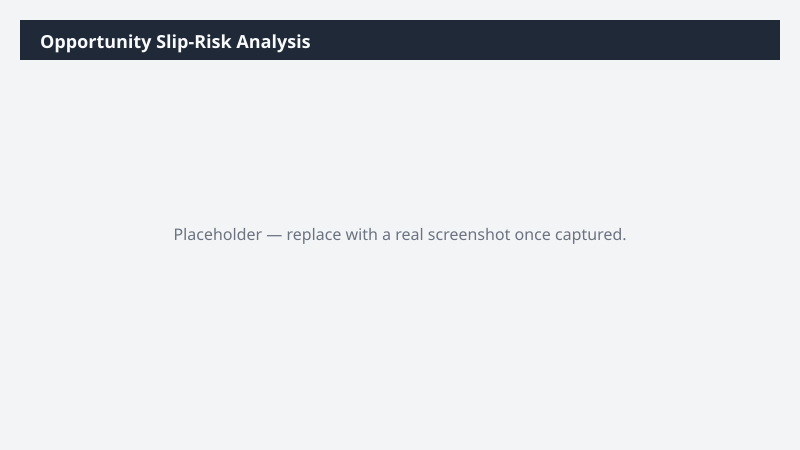

# Opportunity Slip-Risk Analysis

Scores your open opportunities for the risk of slipping past their estimated close date and produces a prioritized workbook of the ones that need attention.

> ⚠ **Draft recipe — not yet verified.** No one has run this against a live Cowork tenant, and the Dataverse table and column names it relies on are taken from Microsoft documentation rather than confirmed against a live environment. The prompt tells Cowork to confirm the schema at runtime before querying, so a mismatch should surface as a correction rather than a wrong answer — but validate before relying on it.

## Business value

Turns a subjective gut-feel forecast review into an evidence-based one. Sellers see which deals are drifting while there is still time to act, and managers stop discovering slipped deals at the end of the quarter.

## What it does

Reads your open opportunities through the Dataverse MCP tools, derives three objective
slip-risk signals from the record data, and writes a prioritized exceptions workbook. All
analysis is read-only.

## Prerequisites

- A Dynamics 365 Sales licence and access to a Dynamics 365 Sales environment
- The Dynamics 365 Sales plugin enabled in your Cowork session (+ > Customize > Dynamics 365 Sales)
- The plugin bound to the environment you want to analyze (gear icon on the plugin tile)

## Step-by-step

1. Open Cowork and confirm the **Dynamics 365 Sales** plugin is toggled on for your session.
2. Check the gear icon on the plugin tile and confirm it is bound to the environment you want
   to analyze.
3. Paste the prompt from `prompt.md` into a new task and send it.
4. Review the Notes sheet first — it tells you which columns Cowork actually used, which is
   where any schema customization in your org will show up.
5. Adjust the 30-day thresholds in the prompt to match your sales cycle and re-run.

## Expected output

An Excel workbook in your Cowork output folder with three sheets. The Summary sheet gives a
count and value total per risk reason; the At Risk sheet is the working list, highest value
first. If you own no open opportunities, Cowork reports that instead of inventing rows.

## Portability

This recipe names no company, environment, or date range. It scopes to the records you own, discovers the Dataverse schema at runtime, and derives its analysis window from the data it finds — so it behaves the same in a trial environment as in a large production org.

## Skills used

OOTB: Excel

Plugin actions: dynamics-365-sales/search, dynamics-365-sales/describe, dynamics-365-sales/read_query

## License

CC-BY-4.0 — see repo `LICENSE`.
