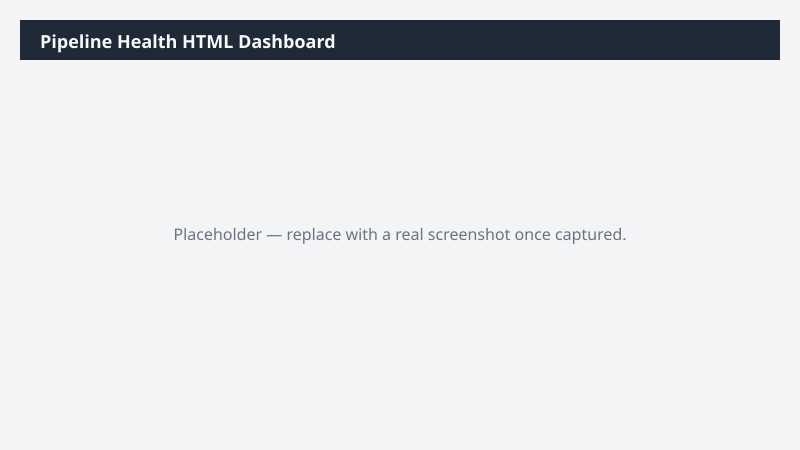

# Pipeline Health HTML Dashboard

Produces a self-contained interactive HTML dashboard of pipeline by stage, value, age, and owner that opens in any browser without Dynamics 365 access.

> ⚠ **Draft recipe — not yet verified.** No one has run this against a live Cowork tenant, and the Dataverse table and column names it relies on are taken from Microsoft documentation rather than confirmed against a live environment. The prompt tells Cowork to confirm the schema at runtime before querying, so a mismatch should surface as a correction rather than a wrong answer — but validate before relying on it.

## Business value

Lets sales leadership share a current pipeline picture with people who have no CRM licence — finance, the exec team, a board pack — without exporting spreadsheets or granting access.

## What it does

Builds a shareable single-file dashboard with inline SVG charts. No external CDN dependency, so
it renders offline and can be emailed as an attachment.

## Prerequisites

- A Dynamics 365 Sales licence and access to a Dynamics 365 Sales environment
- The Dynamics 365 Sales plugin enabled in your Cowork session (+ > Customize > Dynamics 365 Sales)
- The plugin bound to the environment you want to analyze (gear icon on the plugin tile)

## Step-by-step

1. Confirm the **Dynamics 365 Sales** plugin is on and bound to the right environment.
2. Paste the prompt from `prompt.md` and send it.
3. Open the generated HTML file from the Cowork output folder to check it renders standalone
   before sharing it.

## Expected output

A single HTML file that opens in any browser with no network access, showing pipeline value by
stage, age distribution, owner breakdown, and a sortable detail table.

## Portability

This recipe names no company, environment, or date range. It scopes to the records you own, discovers the Dataverse schema at runtime, and derives its analysis window from the data it finds — so it behaves the same in a trial environment as in a large production org.

## Skills used

OOTB: PDF

Plugin actions: dynamics-365-sales/search, dynamics-365-sales/describe, dynamics-365-sales/read_query

## License

CC-BY-4.0 — see repo `LICENSE`.
