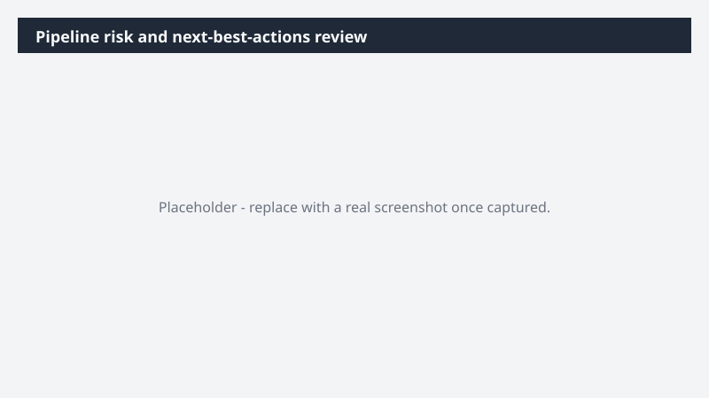

# Pipeline risk and next-best-actions review

Know exactly which deals need attention this week - and exactly what to do - without manually digging through CRM and email threads.

> ⚠ **Draft recipe — not yet verified.** This prompt is reproduced from the Microsoft Copilot Cowork Task Pack for Sales. It has not been run against our tenant, so the output described below is the pack's stated expectation rather than an observed result. Validate before relying on it.

## Business value

Know exactly which deals need attention this week - and exactly what to do - without manually digging through CRM and email threads. An interactive HTML pipeline dashboard covering at-risk deals, stalled opportunities, and recommended next-best-actions per opportunity - grounded in real CRM data and customer engagement signals.

## What it does

An interactive HTML pipeline dashboard covering at-risk deals, stalled opportunities, and recommended next-best-actions per opportunity - grounded in real CRM data and customer engagement signals.

## Prerequisites

- Microsoft 365 Copilot licence with access to Cowork
- Dynamics 365 Sales plugin enabled in your Cowork session, bound to your CRM environment
- A Dynamics 365 Sales licence

## Step-by-step

1. Open Cowork and start a new task.
2. Confirm the required plugin is turned on under **+ > Customize**: Dynamics 365 Sales plugin enabled in your Cowork session, bound to your CRM environment.
3. Paste the prompt from `prompt.md`, replacing anything in square brackets with your own values.
4. Review the plan Cowork proposes before letting it run.
5. Check any drafted email or calendar change before approving it — the prompt holds them for review rather than sending.

## How Cowork works through it

1. Dynamics 365 Sales → Pull current pipeline + activity history
2. Email + Meetings → Cross-check engagement signals
3. Analyze → Risk pattern per opportunity
4. Recommend → Next-best-action per deal
5. Build → Interactive HTML pipeline dashboard
6. Deliver → HTML pipeline dashboard ready for 1:1

## Expected output

An interactive HTML pipeline dashboard covering at-risk deals, stalled opportunities, and recommended next-best-actions per opportunity - grounded in real CRM data and customer engagement signals.

## Source

Adapted from the **Microsoft Copilot Cowork Task Pack for Sales**, a task pack Microsoft publishes for customers. The prompt is reproduced as published; the surrounding recipe metadata, process tagging, and guidance are the Cookbook's.

## Skills used

OOTB: Email, Meetings, Communications

Plugin: dynamics-365-sales

## License

CC-BY-4.0 — see repo `LICENSE`.
