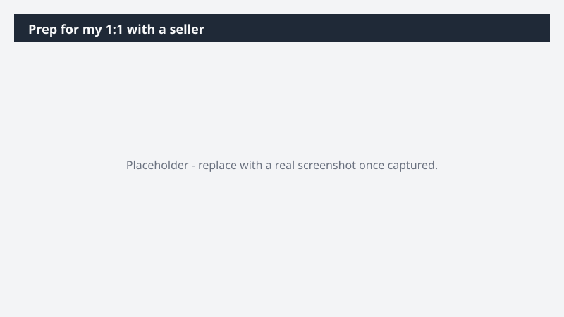

# Prep for my 1:1 with a seller

Walk into every 1:1 with the full picture on your seller's book - and a coaching plan, not just talking points.

> ⚠ **Draft recipe — not yet verified.** This prompt is reproduced from the Microsoft Copilot Cowork Task Pack for Sales. It has not been run against our tenant, so the output described below is the pack's stated expectation rather than an observed result. Validate before relying on it.

## Business value

Walk into every 1:1 with the full picture on your seller's book - and a coaching plan, not just talking points. A structured 1:1 prep brief and an interactive coaching dashboard - showing pipeline, deal movement, win/loss trend, and a focused set of coaching themes ready to work through together.

## What it does

A structured 1:1 prep brief and an interactive coaching dashboard - showing pipeline, deal movement, win/loss trend, and a focused set of coaching themes ready to work through together.

## Prerequisites

- Microsoft 365 Copilot licence with access to Cowork
- Dynamics 365 Sales plugin enabled in your Cowork session, bound to your CRM environment
- A Dynamics 365 Sales licence

## Step-by-step

1. Open Cowork and start a new task.
2. Confirm the required plugin is turned on under **+ > Customize**: Dynamics 365 Sales plugin enabled in your Cowork session, bound to your CRM environment.
3. Paste the prompt from `prompt.md`, replacing anything in square brackets with your own values.
4. Review the plan Cowork proposes before letting it run.
5. Check any drafted email or calendar change before approving it — the prompt holds them for review rather than sending.

## How Cowork works through it

1. Dynamics 365 Sales → Pull rep pipeline, deal movement, and win/loss trend
2. Email + Meetings → Cross-check engagement signals per deal
3. Analyze → Identify the 2-3 deals to focus on and the coaching theme
4. Create → Structured 1:1 prep brief with coaching prompts
5. Deliver → Interactive HTML coaching dashboard (pipeline health · deals to watch · win/loss · development theme)

## Expected output

A structured 1:1 prep brief and an interactive coaching dashboard - showing pipeline, deal movement, win/loss trend, and a focused set of coaching themes ready to work through together.

## Source

Adapted from the **Microsoft Copilot Cowork Task Pack for Sales**, a task pack Microsoft publishes for customers. The prompt is reproduced as published; the surrounding recipe metadata, process tagging, and guidance are the Cookbook's.

## Skills used

OOTB: Email, Meetings

Plugin: dynamics-365-sales

## License

CC-BY-4.0 — see repo `LICENSE`.
