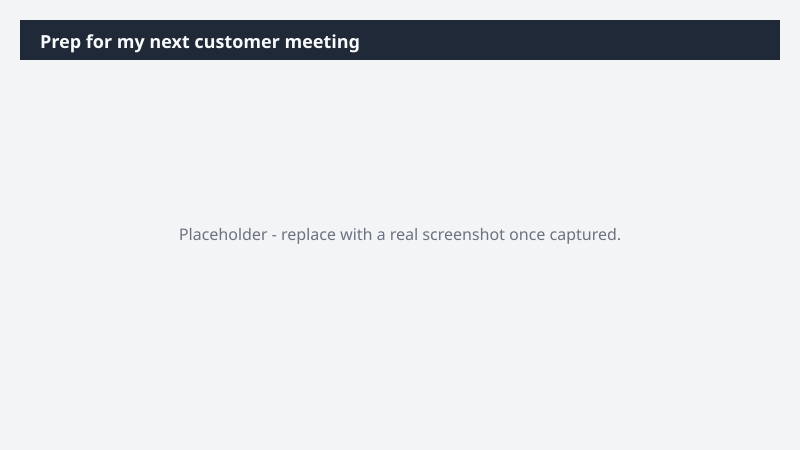

# Prep for my next customer meeting

Walk into your next call already knowing the account cold - no scramble through CRM tabs and email.

> ⚠ **Draft recipe — not yet verified.** This prompt is reproduced from the Microsoft Copilot Cowork Task Pack for Sales. It has not been run against our tenant, so the output described below is the pack's stated expectation rather than an observed result. Validate before relying on it.

## Business value

Walk into your next call already knowing the account cold - no scramble through CRM tabs and email. A single meeting-prep brief pulling account history, open opportunities, recent activity, and calendar context.

## What it does

A single meeting-prep brief pulling account history, open opportunities, recent activity, and calendar context.

## Prerequisites

- Microsoft 365 Copilot licence with access to Cowork
- Dynamics 365 Sales plugin enabled in your Cowork session, bound to your CRM environment
- A Dynamics 365 Sales licence

## Step-by-step

1. Open Cowork and start a new task.
2. Confirm the required plugin is turned on under **+ > Customize**: Dynamics 365 Sales plugin enabled in your Cowork session, bound to your CRM environment.
3. Paste the prompt from `prompt.md`, replacing anything in square brackets with your own values.
4. Review the plan Cowork proposes before letting it run.
5. Check any drafted email or calendar change before approving it — the prompt holds them for review rather than sending.

## How Cowork works through it

1. Dynamics 365 Sales → Pull account history, open opportunities, and recent activity
2. Email + Meetings → Identify what's changed since last contact
3. Deliver → Word meeting-prep brief (relationship status · open items · focus areas)

## Expected output

A single meeting-prep brief pulling account history, open opportunities, recent activity, and calendar context.

## Source

Adapted from the **Microsoft Copilot Cowork Task Pack for Sales**, a task pack Microsoft publishes for customers. The prompt is reproduced as published; the surrounding recipe metadata, process tagging, and guidance are the Cookbook's.

## Skills used

OOTB: Word, Email, Calendar Management, Meetings

Plugin: dynamics-365-sales

## License

CC-BY-4.0 — see repo `LICENSE`.
