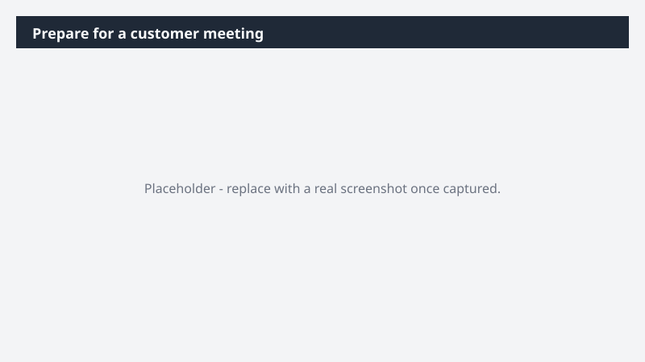

# Prepare for a customer meeting

Walk into your next customer meeting fully briefed - context pulled, deck built, prep time blocked.

> ⚠ **Draft recipe — not yet verified.** This prompt is reproduced from the Microsoft Copilot Cowork Task Pack for Sales. It has not been run against our tenant, so the output described below is the pack's stated expectation rather than an observed result. Validate before relying on it.

> **Tip.** Note: This Task runs on your Microsoft 365 context. With the Dynamics 365 Sales plugin enabled, Cowork also pulls the account's live CRM data - open opportunities and recent activity - into the brief.

## Business value

Walk into your next customer meeting fully briefed - context pulled, deck built, prep time blocked. A Word briefing document, an Excel customer trends overview, a client-ready PowerPoint pitch, a calendar prep block, and a draft customer update email - all sequenced before the meeting.

## What it does

A Word briefing document, an Excel customer trends overview, a client-ready PowerPoint pitch, a calendar prep block, and a draft customer update email - all sequenced before the meeting.

## Prerequisites

- Microsoft 365 Copilot licence with access to Cowork
- Dynamics 365 Sales plugin enabled in your Cowork session, bound to your CRM environment
- A Dynamics 365 Sales licence

## Step-by-step

1. Open Cowork and start a new task.
2. Confirm the required plugin is turned on under **+ > Customize**: Dynamics 365 Sales plugin enabled in your Cowork session, bound to your CRM environment.
3. Paste the prompt from `prompt.md`, replacing anything in square brackets with your own values.
4. Review the plan Cowork proposes before letting it run.
5. Check any drafted email or calendar change before approving it — the prompt holds them for review rather than sending.

## How Cowork works through it

1. Email + Calendar + Files → Pull customer context
2. Dynamics 365 Sales (optional) → Layer in account opportunities + recent CRM activity
3. [Customer Brief Template.docx] → Build the briefing document
4. Excel → Create usage and sales trend overview with graphs
5. Web + Files → Research competitive differentiation
6. PowerPoint → Build client-ready pitch (differentiation · opportunities · next steps)
7. Calendar → Block 30-minute prep time with [Prep Attendee Name]
8. Draft → Customer update email for account team review

## Expected output

A Word briefing document, an Excel customer trends overview, a client-ready PowerPoint pitch, a calendar prep block, and a draft customer update email - all sequenced before the meeting.

## Source

Adapted from the **Microsoft Copilot Cowork Task Pack for Sales**, a task pack Microsoft publishes for customers. The prompt is reproduced as published; the surrounding recipe metadata, process tagging, and guidance are the Cookbook's.

## Skills used

OOTB: Word, Excel, PowerPoint, Email, Calendar Management, Scheduling

Plugin: dynamics-365-sales

## License

CC-BY-4.0 — see repo `LICENSE`.
