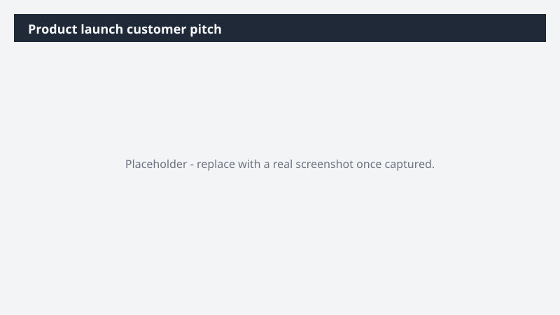

# Product launch customer pitch

Turn a competitor announcement into a sharp, differentiated customer pitch - built and ready before tomorrow's meeting.

> ⚠ **Draft recipe — not yet verified.** This prompt is reproduced from the Microsoft Copilot Cowork Task Pack for Sales. It has not been run against our tenant, so the output described below is the pack's stated expectation rather than an observed result. Validate before relying on it.

## Business value

Turn a competitor announcement into a sharp, differentiated customer pitch - built and ready before tomorrow's meeting. An Excel competitive comparison, a Word value prop document, and a customer-ready PowerPoint pitch deck - a three-artifact kit ready for tomorrow's meeting.

## What it does

An Excel competitive comparison, a Word value prop document, and a customer-ready PowerPoint pitch deck - a three-artifact kit ready for tomorrow's meeting.

## Prerequisites

- Microsoft 365 Copilot licence with access to Cowork

## Step-by-step

1. Open Cowork and start a new task.
2. Paste the prompt from `prompt.md`, replacing anything in square brackets with your own values.
3. Review the plan Cowork proposes before letting it run.
4. Check any drafted email or calendar change before approving it — the prompt holds them for review rather than sending.

## How Cowork works through it

1. Web + Files → Research [Competitor Product] announcement
2. Excel → Consultant-level product comparison table
3. Word → Value prop document grounded in [Product] differentiation
4. PowerPoint → Customer pitch deck (competitive framing · value prop · next steps)
5. Deliver → Excel comparison + Word value prop + PowerPoint pitch deck

## Expected output

An Excel competitive comparison, a Word value prop document, and a customer-ready PowerPoint pitch deck - a three-artifact kit ready for tomorrow's meeting.

## Source

Adapted from the **Microsoft Copilot Cowork Task Pack for Sales**, a task pack Microsoft publishes for customers. The prompt is reproduced as published; the surrounding recipe metadata, process tagging, and guidance are the Cookbook's.

## Skills used

OOTB: Word, Excel, PowerPoint, Meetings, Communications

Plugin: none required

## License

CC-BY-4.0 — see repo `LICENSE`.
