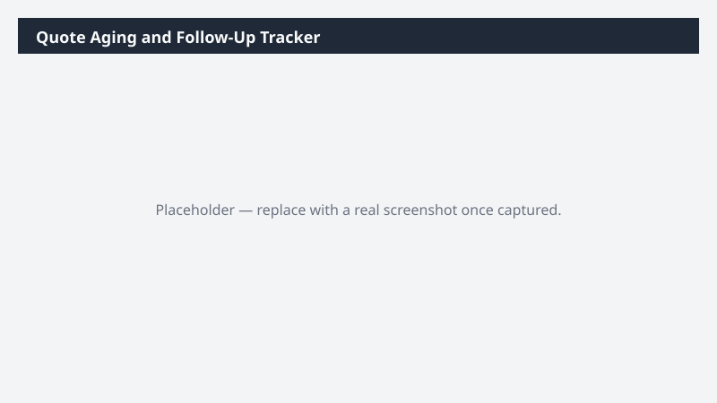

# Quote Aging and Follow-Up Tracker

Lists your outstanding quotes by age, flags the ones past their expiry or overdue for follow-up, and totals the value sitting unanswered.

> ⚠ **Draft recipe — not yet verified.** No one has run this against a live Cowork tenant, and the Dataverse table and column names it relies on are taken from Microsoft documentation rather than confirmed against a live environment. The prompt tells Cowork to confirm the schema at runtime before querying, so a mismatch should surface as a correction rather than a wrong answer — but validate before relying on it.

## Business value

Quotes that expire without a decision are lost revenue nobody decided to give up. This puts a number on the unanswered pipeline and orders the follow-up queue by value at risk.

## What it does

Ages the open quote book against whatever expiry semantics your environment records, and totals
the value in each urgency band. Read-only.

## Prerequisites

- A Dynamics 365 Sales licence and access to a Dynamics 365 Sales environment
- The Dynamics 365 Sales plugin enabled in your Cowork session (+ > Customize > Dynamics 365 Sales)
- The plugin bound to the environment you want to analyze (gear icon on the plugin tile)

## Step-by-step

1. Confirm the **Dynamics 365 Sales** plugin is on and bound to the right environment.
2. Paste the prompt from `prompt.md` and send it.
3. If your org does not populate quote expiry dates, Cowork will report that — the aging bands
   then fall back to quote age alone, which is still useful.

## Expected output

A three-sheet workbook. The Summary sheet answers 'how much value is sitting in expired or
nearly-expired quotes', which is usually the number worth escalating.

## Portability

This recipe names no company, environment, or date range. It scopes to the records you own, discovers the Dataverse schema at runtime, and derives its analysis window from the data it finds — so it behaves the same in a trial environment as in a large production org.

## Skills used

OOTB: Excel

Plugin actions: dynamics-365-sales/search, dynamics-365-sales/describe, dynamics-365-sales/read_query

## License

CC-BY-4.0 — see repo `LICENSE`.
