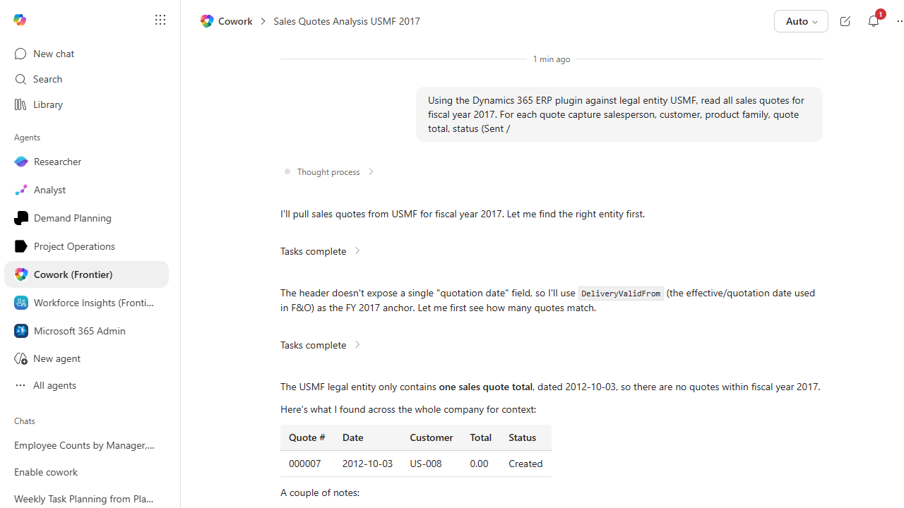

# Quote Conversion Funnel Analysis (HTML)

Analyzes won/lost/expired sales quotes by salesperson, product family, and reason; produces a funnel chart HTML and a workbook.

> ℹ **Tenant data caveat.** Validated against a live Cowork tenant on 2026-05-23 with USMF. Cowork engaged the D365 ERP plugin and used the DeliveryValidFrom field as the quotation-date anchor (the header doesn't expose a single 'quotation date' field). Honesty result: USMF contains exactly ONE sales quote in its entire history (Quote 000007, 2012-10-03, US-008, total $0.00, status 'Created'). There are no FY2017 quotes, so a meaningful funnel can't be built. Cowork stopped and offered to widen the search to all years or to swap to a different document type (sales orders or sales invoices) for FY2017. This is an excellent demonstration of Cowork honestly halting when the source data won't support a meaningful answer - the right behavior for a sales-pipeline analytic. Run this recipe against a tenant with real quote activity to get the full funnel chart and pivoted breakdowns.

## Business value

Highlights where deals are leaking from the quote pipeline (which salesperson, which product, which lost-reason) so sales coaching and product positioning effort can be targeted with evidence.

## What it does

Surfaces quote-pipeline leakage with both a workbook for analysis and an HTML funnel for sales leadership review.

## Prerequisites

- Dynamics 365 F&SCM access with the Sales manager role
- Cowork D365 ERP plugin enabled

## Step-by-step

1. Paste the prompt.
2. Review with the sales leadership team.
3. Use the lost-reason breakdown to drive a coaching agenda.

## Expected output

One Excel workbook and one HTML funnel chart.

## Skills used

OOTB: Excel, PDF
Plugin actions: dynamics-365-erp/data_find_entity_type, dynamics-365-erp/data_find_entities_sql

## License

CC-BY-4.0 — see repo `LICENSE`.
