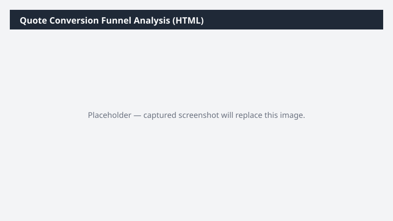

# Quote Conversion Funnel Analysis (HTML)

Analyzes won/lost/expired sales quotes by salesperson, product family, and reason; produces a funnel chart HTML and a workbook.

> ⚠ **Draft recipe — not yet verified.** The prompt, OOTB skill list, and plugin actions named below are starter content. No one has run this against a live Cowork tenant with the Dynamics 365 ERP plugin yet. Validate before relying on it.

## Business value

Highlights where deals are leaking from the quote pipeline (which salesperson, which product, which lost-reason) so sales coaching and product positioning effort can be targeted with evidence.

## What it does

Surfaces quote-pipeline leakage with both a workbook for analysis and an HTML funnel for sales leadership review.

## Prerequisites

- Dynamics 365 F&SCM access with the Sales manager role
- Cowork D365 ERP plugin enabled

## Step-by-step

1. Paste the prompt.
2. Review with the sales leadership team.
3. Use the lost-reason breakdown to drive a coaching agenda.

## Expected output

One Excel workbook and one HTML funnel chart.

## Skills used

OOTB: Excel, PDF
Plugin actions: dynamics-365-erp/data_find_entity_type, dynamics-365-erp/data_find_entities_sql

## License

CC-BY-4.0 — see repo `LICENSE`.
