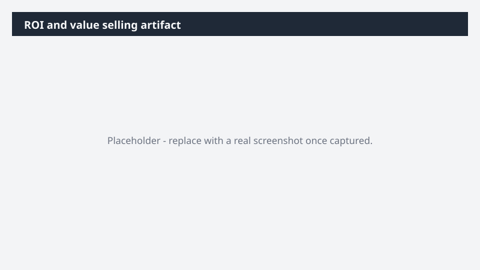

# ROI and value selling artifact

Build an executive-level business value story for a customer - use cases, ROI model, and call to action - delivered as a deck and microsite.

> ⚠ **Draft recipe — not yet verified.** This prompt is reproduced from the Microsoft Copilot Cowork Task Pack for Sales. It has not been run against our tenant, so the output described below is the pack's stated expectation rather than an observed result. Validate before relying on it.

## Business value

Build an executive-level business value story for a customer - use cases, ROI model, and call to action - delivered as a deck and microsite. A 5-7 slide PowerPoint executive deck and an interactive HTML executive microsite - strategic context, 9 use cases, prioritization matrix, pain → outcome map, KPIs, transparent ROI model, and a workshop → pilot → scale call to action.

## What it does

A 5-7 slide PowerPoint executive deck and an interactive HTML executive microsite - strategic context, 9 use cases, prioritization matrix, pain → outcome map, KPIs, transparent ROI model, and a workshop → pilot → scale call to action.

## Prerequisites

- Microsoft 365 Copilot licence with access to Cowork

## Step-by-step

1. Open Cowork and start a new task.
2. Paste the prompt from `prompt.md`, replacing anything in square brackets with your own values.
3. Review the plan Cowork proposes before letting it run.
4. Check any drafted email or calendar change before approving it — the prompt holds them for review rather than sending.

## How Cowork works through it

1. Q&A → Gather customer inputs one at a time
2. Web + Public Filings → Research customer strategic context
3. Generate → 9 use cases aligned to customer strategy (3 per category)
4. Prioritize → 2x2 matrix (Ease of Implementation vs. Business Impact)
5. Map → Pain → Outcome → [Product] Capability
6. Model → Transparent ROI calculation with editable assumptions
7. CTA → Workshop → Pilot → Scale via [Engagement Program]
8. Deliver → PowerPoint exec deck + interactive HTML microsite

## Expected output

A 5-7 slide PowerPoint executive deck and an interactive HTML executive microsite - strategic context, 9 use cases, prioritization matrix, pain → outcome map, KPIs, transparent ROI model, and a workshop → pilot → scale call to action.

## Source

Adapted from the **Microsoft Copilot Cowork Task Pack for Sales**, a task pack Microsoft publishes for customers. The prompt is reproduced as published; the surrounding recipe metadata, process tagging, and guidance are the Cookbook's.

## Skills used

OOTB: PowerPoint

Plugin: none required

## License

CC-BY-4.0 — see repo `LICENSE`.
