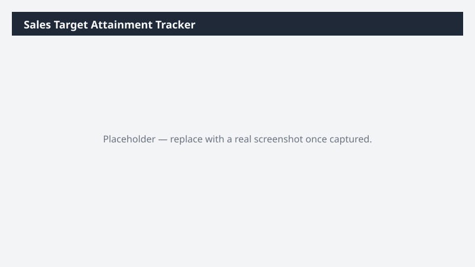

# Sales Target Attainment Tracker

Compares actual closed-won performance against recorded sales targets and reports attainment, gap to target, and the pipeline coverage available to close it.

> ⚠ **Draft recipe — not yet verified.** No one has run this against a live Cowork tenant, and the Dataverse table and column names it relies on are taken from Microsoft documentation rather than confirmed against a live environment. The prompt tells Cowork to confirm the schema at runtime before querying, so a mismatch should surface as a correction rather than a wrong answer — but validate before relying on it.

## Business value

Answers the two questions every sales review starts with — where are we against target, and is there enough pipeline to make up the gap — without anyone rebuilding the spreadsheet each time.

## What it does

Locates however this environment stores targets, then reports attainment and pipeline coverage
against them. Degrades honestly to an actuals-only report when no target data exists.

## Prerequisites

- A Dynamics 365 Sales licence and access to a Dynamics 365 Sales environment
- The Dynamics 365 Sales plugin enabled in your Cowork session (+ > Customize > Dynamics 365 Sales)
- The plugin bound to the environment you want to analyze (gear icon on the plugin tile)

## Step-by-step

1. Confirm the **Dynamics 365 Sales** plugin is on and bound to the right environment.
2. Paste the prompt from `prompt.md` and send it.
3. Read the Notes sheet to confirm Cowork found the target source you expected — target storage
   varies more between orgs than almost any other Sales data.

## Expected output

A three-sheet workbook covering attainment, gap, and coverage. If your environment has no target
data, expect an actuals-and-pipeline report plus an explicit statement that no targets were
found.

## Portability

This recipe names no company, environment, or date range. It scopes to the records you own, discovers the Dataverse schema at runtime, and derives its analysis window from the data it finds — so it behaves the same in a trial environment as in a large production org.

## Skills used

OOTB: Excel

Plugin actions: dynamics-365-sales/search, dynamics-365-sales/describe, dynamics-365-sales/read_query

## License

CC-BY-4.0 — see repo `LICENSE`.
