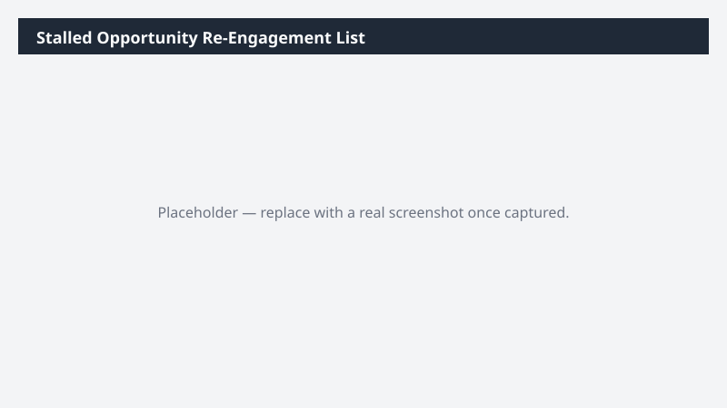

# Stalled Opportunity Re-Engagement List

Finds open opportunities with no recent activity and drafts a tailored re-engagement approach for each, so dormant deals get a deliberate next step.

> ⚠ **Draft recipe — not yet verified.** No one has run this against a live Cowork tenant, and the Dataverse table and column names it relies on are taken from Microsoft documentation rather than confirmed against a live environment. The prompt tells Cowork to confirm the schema at runtime before querying, so a mismatch should surface as a correction rather than a wrong answer — but validate before relying on it.

## Business value

Recovers pipeline that would otherwise age out silently. Instead of a generic 'check in' sweep, each dormant deal gets a next step informed by its stage, value, and what happened last.

## What it does

Correlates opportunities with their activity history to find dormancy, then produces both a
working list and a shareable summary. Read-only; drafts nothing into your CRM.

## Prerequisites

- A Dynamics 365 Sales licence and access to a Dynamics 365 Sales environment
- The Dynamics 365 Sales plugin enabled in your Cowork session (+ > Customize > Dynamics 365 Sales)
- The plugin bound to the environment you want to analyze (gear icon on the plugin tile)

## Step-by-step

1. Confirm the **Dynamics 365 Sales** plugin is on and bound to the right environment.
2. Paste the prompt from `prompt.md` and send it.
3. Check the reported activity-date range — if it looks short, your activity tracking may not
   be capturing what you expect.
4. Tune the 45-day dormancy threshold to your sales cycle.

## Expected output

A two-sheet workbook plus a short paragraph you can paste into Teams. Each detail row carries a
concrete re-engagement angle drawn from that opportunity's own history.

## Portability

This recipe names no company, environment, or date range. It scopes to the records you own, discovers the Dataverse schema at runtime, and derives its analysis window from the data it finds — so it behaves the same in a trial environment as in a large production org.

## Skills used

OOTB: Excel, Communications

Plugin actions: dynamics-365-sales/search, dynamics-365-sales/describe, dynamics-365-sales/read_query

## License

CC-BY-4.0 — see repo `LICENSE`.
