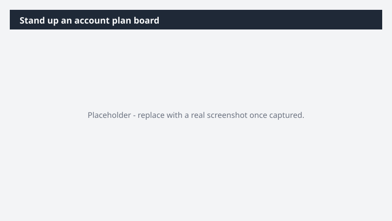

# Stand up an account plan board

Move from a scattered account plan to a structured working board the full account team can run against.

> ⚠ **Draft recipe — not yet verified.** This prompt is reproduced from the Microsoft Copilot Cowork Task Pack for Sales. It has not been run against our tenant, so the output described below is the pack's stated expectation rather than an observed result. Validate before relying on it.

## Business value

Move from a scattered account plan to a structured working board the full account team can run against. A Monday.com account plan board capturing stakeholders, workstreams, next steps, and owners - built from your real customer context - so the account team has a single source of truth.

## What it does

A Monday.com account plan board capturing stakeholders, workstreams, next steps, and owners - built from your real customer context - so the account team has a single source of truth.

## Prerequisites

- Microsoft 365 Copilot licence with access to Cowork
- monday.com plugin enabled and connected to your workspace

## Step-by-step

1. Open Cowork and start a new task.
2. Confirm the required plugin is turned on under **+ > Customize**: monday.com plugin enabled and connected to your workspace.
3. Paste the prompt from `prompt.md`, replacing anything in square brackets with your own values.
4. Review the plan Cowork proposes before letting it run.
5. Check any drafted email or calendar change before approving it — the prompt holds them for review rather than sending.

## How Cowork works through it

1. Email + Meetings + Files → Identify workstreams + stakeholders
2. Extract → Open next steps + owners
3. Cluster → Tasks by workstream
4. Structure → Board schema + groupings
5. Monday.com → Create account plan board
6. Deliver → Monday.com account plan board (workstreams · owners · status · next steps · due dates)

## Expected output

A Monday.com account plan board capturing stakeholders, workstreams, next steps, and owners - built from your real customer context - so the account team has a single source of truth.

## Source

Adapted from the **Microsoft Copilot Cowork Task Pack for Sales**, a task pack Microsoft publishes for customers. The prompt is reproduced as published; the surrounding recipe metadata, process tagging, and guidance are the Cookbook's.

## Skills used

OOTB: Email, Meetings, Communications

Plugin: monday-com

## License

CC-BY-4.0 — see repo `LICENSE`.
