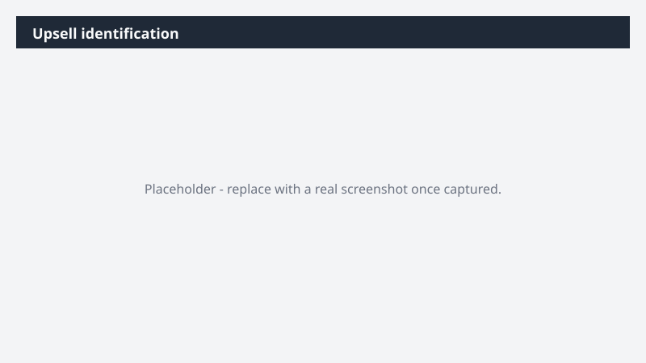

# Upsell identification

Find the best expansion opportunity in your book this week and arrive with a pitch already built.

> ⚠ **Draft recipe — not yet verified.** This prompt is reproduced from the Microsoft Copilot Cowork Task Pack for Sales. It has not been run against our tenant, so the output described below is the pack's stated expectation rather than an observed result. Validate before relying on it.

> **Tip.** Note: This Task runs on an uploaded CRM snapshot. For live data, the Dynamics 365 Sales plugin is optional but recommended - it lets Cowork pull account and renewal signals directly from your CRM.

## Business value

Find the best expansion opportunity in your book this week and arrive with a pitch already built. A 5-slide PowerPoint Expansion Pack, a 1-page Word internal account plan, and a draft executive outreach email - held for review before sending.

## What it does

A 5-slide PowerPoint Expansion Pack, a 1-page Word internal account plan, and a draft executive outreach email - held for review before sending.

## Prerequisites

- Microsoft 365 Copilot licence with access to Cowork
- Dynamics 365 Sales plugin enabled in your Cowork session, bound to your CRM environment
- A Dynamics 365 Sales licence

## Step-by-step

1. Open Cowork and start a new task.
2. Confirm the required plugin is turned on under **+ > Customize**: Dynamics 365 Sales plugin enabled in your Cowork session, bound to your CRM environment.
3. Paste the prompt from `prompt.md`, replacing anything in square brackets with your own values.
4. Review the plan Cowork proposes before letting it run.
5. Check any drafted email or calendar change before approving it — the prompt holds them for review rather than sending.

## How Cowork works through it

1. [CRM Account Snapshot] or Dynamics 365 Sales → Pull account renewal and engagement signals
2. Email + Meetings + Web → Score accounts by expansion likelihood
3. Analyze → Rank and select top account
4. Summarize → Current state · value realized · unmet needs · decision makers
5. PowerPoint → 5-slide Expansion Pack deck
6. Word → 1-page internal account plan
7. Draft → Executive outreach email (hold for review before sending)

## Expected output

A 5-slide PowerPoint Expansion Pack, a 1-page Word internal account plan, and a draft executive outreach email - held for review before sending.

## Source

Adapted from the **Microsoft Copilot Cowork Task Pack for Sales**, a task pack Microsoft publishes for customers. The prompt is reproduced as published; the surrounding recipe metadata, process tagging, and guidance are the Cookbook's.

## Skills used

OOTB: Word, Excel, PowerPoint, Email, Calendar Management, Meetings

Plugin: dynamics-365-sales

## License

CC-BY-4.0 — see repo `LICENSE`.
