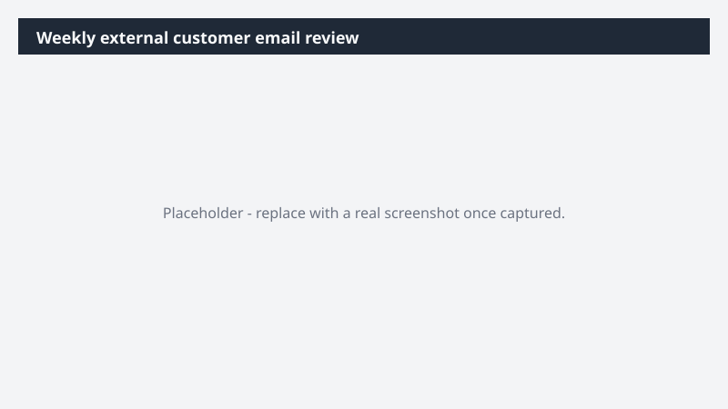

# Weekly external customer email review

Every Monday, surface action items from external customer emails, draft replies in thread, and remind yourself to review before anything goes out.

> ⚠ **Draft recipe — not yet verified.** This prompt is reproduced from the Microsoft Copilot Cowork Task Pack for Sales. It has not been run against our tenant, so the output described below is the pack's stated expectation rather than an observed result. Validate before relying on it.

> **Tip.** Note: This is a scheduled Cowork prompt - it runs automatically every Monday morning. Save it as a skill so it repeats without re-prompting. All replies are held as drafts for your review before anything is sent. See Cowork skills.

## Business value

Every Monday, surface action items from external customer emails, draft replies in thread, and remind yourself to review before anything goes out. Outlook draft replies waiting in your Drafts folder, an email summary reminder, and a Teams self-message - queued every Monday morning so the inbox is already moving when you sit down.

## What it does

Outlook draft replies waiting in your Drafts folder, an email summary reminder, and a Teams self-message - queued every Monday morning so the inbox is already moving when you sit down.

## Prerequisites

- Microsoft 365 Copilot licence with access to Cowork

## Step-by-step

1. Open Cowork and start a new task.
2. Paste the prompt from `prompt.md`, replacing anything in square brackets with your own values.
3. Review the plan Cowork proposes before letting it run.
4. Check any drafted email or calendar change before approving it — the prompt holds them for review rather than sending.

## How Cowork works through it

1. Schedule → Runs every Monday morning
2. Email inbox → Filter prior week · external senders only · action items flagged
3. Analyze → Identify required response per thread
4. Draft → Reply in original thread (stored in Drafts - not sent)
5. Email → Summary reminder to self
6. Teams → Self-message reminder to review drafts

## Expected output

Outlook draft replies waiting in your Drafts folder, an email summary reminder, and a Teams self-message - queued every Monday morning so the inbox is already moving when you sit down.

## Source

Adapted from the **Microsoft Copilot Cowork Task Pack for Sales**, a task pack Microsoft publishes for customers. The prompt is reproduced as published; the surrounding recipe metadata, process tagging, and guidance are the Cookbook's.

## Skills used

OOTB: Email, Scheduling, Communications

Plugin: none required

## License

CC-BY-4.0 — see repo `LICENSE`.
