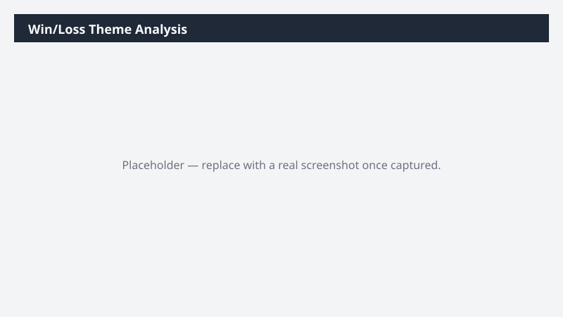

# Win/Loss Theme Analysis

Analyzes closed opportunities to surface recurring themes in why deals are won and lost, grouped by reason, competitor, value band, and stage.

> ⚠ **Draft recipe — not yet verified.** No one has run this against a live Cowork tenant, and the Dataverse table and column names it relies on are taken from Microsoft documentation rather than confirmed against a live environment. The prompt tells Cowork to confirm the schema at runtime before querying, so a mismatch should surface as a correction rather than a wrong answer — but validate before relying on it.

## Business value

Converts loss reasons from a field nobody reads into a ranked list of what is actually costing deals, which is what makes enablement and product feedback specific enough to act on.

## What it does

Combines structured reason-code analysis with theme extraction from free-text notes, and
attaches record counts to every theme so weak signals are visible as weak.

## Prerequisites

- A Dynamics 365 Sales licence and access to a Dynamics 365 Sales environment
- The Dynamics 365 Sales plugin enabled in your Cowork session (+ > Customize > Dynamics 365 Sales)
- The plugin bound to the environment you want to analyze (gear icon on the plugin tile)

## Step-by-step

1. Confirm the **Dynamics 365 Sales** plugin is on and bound to the right environment.
2. Paste the prompt from `prompt.md` and send it.
3. Check the record count behind each theme before quoting it anywhere — a theme supported by
   three deals is a hypothesis, not a finding.

## Expected output

A multi-sheet workbook plus a short deck. Where loss reasons are poorly populated, expect Cowork
to say so directly rather than over-reading a thin field.

## Portability

This recipe names no company, environment, or date range. It scopes to the records you own, discovers the Dataverse schema at runtime, and derives its analysis window from the data it finds — so it behaves the same in a trial environment as in a large production org.

## Skills used

OOTB: Excel, PowerPoint

Plugin actions: dynamics-365-sales/search, dynamics-365-sales/describe, dynamics-365-sales/read_query

## License

CC-BY-4.0 — see repo `LICENSE`.
