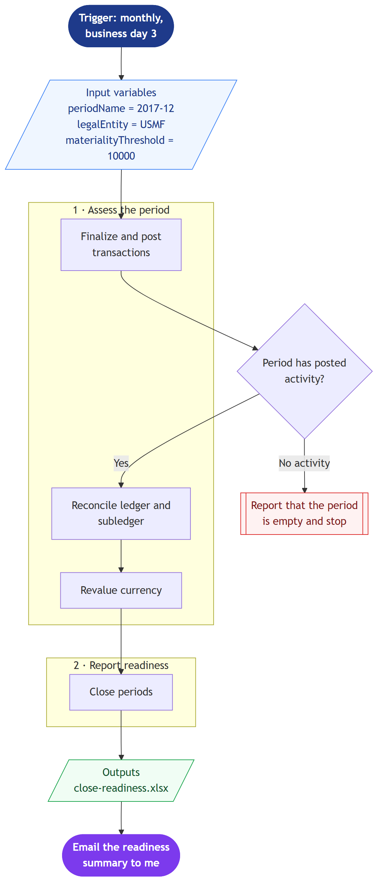
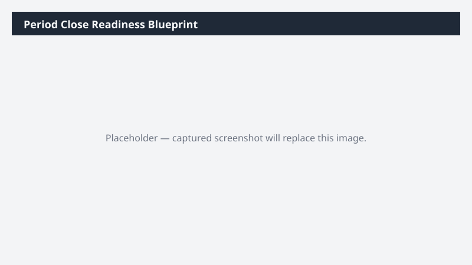

# Period Close Readiness Blueprint

Paste this period-close workflow blueprint into Cowork and it assesses whether the period is ready to close — unposted work, subledger-to-GL differences, and FX exposure.

> ⚠ **Draft recipe — not yet verified.** The blueprint below is generated from the Business Process Catalog but has not been run against a live Cowork tenant. Validate before relying on it.

## Business value

Answers 'can we close?' on demand instead of on business day 5, so the controller chases the two subledgers that are actually blocking rather than polling every owner.

## How to run it

1. Open a new Cowork task and turn the **Dynamics 365 ERP** plugin toggle on.
2. Paste the blueprint image below into the message.
3. Paste the prompt from `prompt.md` into the **same** message.
4. Send. Cowork reads the diagram for structure and the prompt for values.

## Blueprint

Mermaid source: [`blueprint.mmd`](blueprint.mmd)

## Process phases

1. **Assess the period** — Finalize and post transactions, Reconcile ledger and subledger, Revalue currency
2. **Report readiness** — Close periods

Derived from the Microsoft Business Process Catalog area **Close financial periods** (`record-to-report/close-financial-periods`) — [Microsoft Learn](https://learn.microsoft.com/en-us/dynamics365/guidance/business-processes/record-to-report-close-financial-periods).

## Input bindings

| Variable | Value | Meaning |
| --- | --- | --- |
| `periodName` | 2017-12 | Fiscal period to assess. USMF demo data is mostly FY2017. |
| `legalEntity` | USMF | Legal entity to scope every query to. |
| `materialityThreshold` | 10000 | Differences below this are listed but not flagged as blocking. |

## Guardrails

- Read only. Do not post journals, do not lock or close any period, do not run consolidation.
- Produce the workbook in this run — do not return a plan or a methodology document instead.
- Report readiness and differences; leave every close decision to me.

## Expected output

One workbook in `Documents/Cowork/output/` plus an email draft. Where a check is blocked, Cowork returns a constraint table naming the entity it needed — that table is itself the deliverable for the admin who has to expose it.

## Prerequisites

- Dynamics 365 F&SCM access with the General ledger role
- Cowork D365 ERP plugin toggled on in the session

## Skills used

OOTB: Excel, Email

Plugin actions: dynamics-365-erp/data_find_entity_type, dynamics-365-erp/data_find_entities_sql

## License

CC-BY-4.0 — see repo `LICENSE`.
