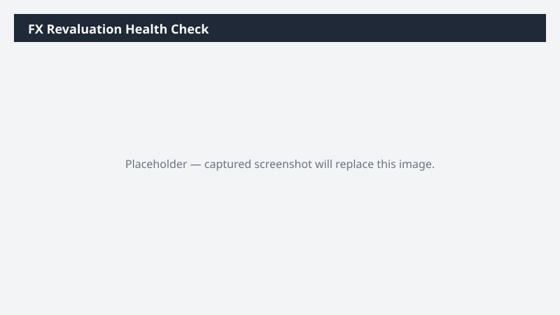

# FX Revaluation Health Check

Reviews FX revaluation configuration and last-run status, and flags any monetary accounts that look misconfigured.

> ⚠ **Draft recipe — not yet verified.** The prompt, OOTB skill list, and plugin actions named below are starter content. No one has run this against a live Cowork tenant with the Dynamics 365 ERP plugin yet. Validate before relying on it.

## Business value

Prevents misstated currency exposure by catching unflagged monetary accounts and skipped revaluations before they hit the financials.

## What it does

Detects misconfigured monetary accounts and missed FX revaluation runs.

## Prerequisites

- Dynamics 365 F&SCM access with the General ledger user role

## Step-by-step

1. Open Cowork and paste the prompt.
2. Review the workbook with the GL team before changing any setup.

## Expected output

Workbook listing misconfigured accounts and missed runs.

## Skills used

OOTB: Excel
Plugin actions: dynamics-365-erp/data_find_entity_type, dynamics-365-erp/data_find_entities_sql

## License

CC-BY-4.0 — see repo `LICENSE`.
