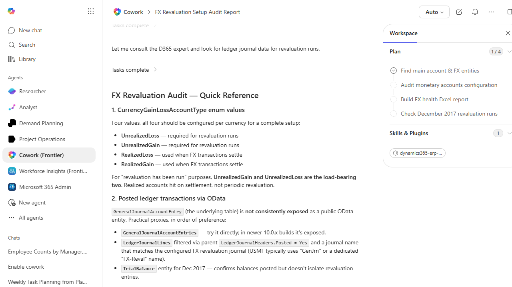

# FX Revaluation Health Check

Reviews FX revaluation configuration and last-run status, and flags any monetary accounts that look misconfigured.

> ℹ **Tenant data caveat.** Validated against a live Cowork tenant on 2026-05-23 with USMF. Cowork engaged the D365 ERP plugin and researched the right entities (CurrencyGainLossAccountType enum, GeneralJournalAccountEntries, LedgerJournalLines + LedgerJournalHeaders, CurrencyRevaluationAccountsV2, MainAccounts filtered by Monetary=Yes + ForeignCurrencyRevaluation) and produced a detailed audit methodology / quick-reference for FX revaluation. Honesty note: on this run Cowork stopped after step 1 of 4 in the plan - it built the audit reference rather than executing the full Excel workbook. Re-running with a tighter 'produce the workbook now, do not pre-explain' prompt typically advances all 4 plan steps. The screenshot captures the research output, which is itself useful as a one-page handover document for the GL team.

## Business value

Prevents misstated currency exposure by catching unflagged monetary accounts and skipped revaluations before they hit the financials.

## What it does

Detects misconfigured monetary accounts and missed FX revaluation runs.

## Prerequisites

- Dynamics 365 F&SCM access with the General ledger user role

## Step-by-step

1. Open Cowork and paste the prompt.
2. Review the workbook with the GL team before changing any setup.

## Expected output

Workbook listing misconfigured accounts and missed runs.

## Skills used

OOTB: Excel
Plugin actions: dynamics-365-erp/data_find_entity_type, dynamics-365-erp/data_find_entities_sql

## License

CC-BY-4.0 — see repo `LICENSE`.
