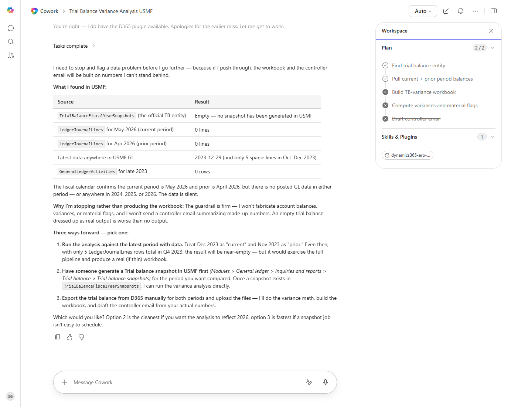

# GL Trial Balance Variance Report

Compares the current-period trial balance to the prior period and highlights GL accounts with material variances.

> ℹ **Tenant data caveat.** Validated against a live Cowork tenant on 2026-05-23. The agent correctly routed to the D365 ERP plugin, discovered the right entity (TrialBalanceFiscalYearSnapshots), and queried LedgerJournalLines / GeneralLedgerActivities. In the USMF demo dataset there were no posted GL transactions in the current or prior period, so the agent honestly refused to fabricate balances and offered three remediation paths instead. Run this recipe against a tenant with current-period GL postings to get a fully-populated workbook.

## Business value

Cuts month-end review time by focusing the controller on the GL accounts with material variances instead of every line in the trial balance.

## What it does

Pulls the trial balance for two consecutive periods, computes variance, flags material lines, and produces a workbook + email draft.

## Prerequisites

- Dynamics 365 F&SCM access with the General ledger user role
- Cowork D365 ERP plugin enabled

## Step-by-step

1. Open Cowork and paste the prompt.
2. Approve the read-only data access when prompted.
3. Review the produced workbook in the side panel.
4. Edit the email draft recipients before sending.

## Expected output

An Excel workbook with Material/All sheets and a draft email summarizing the top variances.

## Skills used

OOTB: Excel, Email
Plugin actions: dynamics-365-erp/data_find_entity_type, dynamics-365-erp/data_find_entities_sql

## License

CC-BY-4.0 — see repo `LICENSE`.
