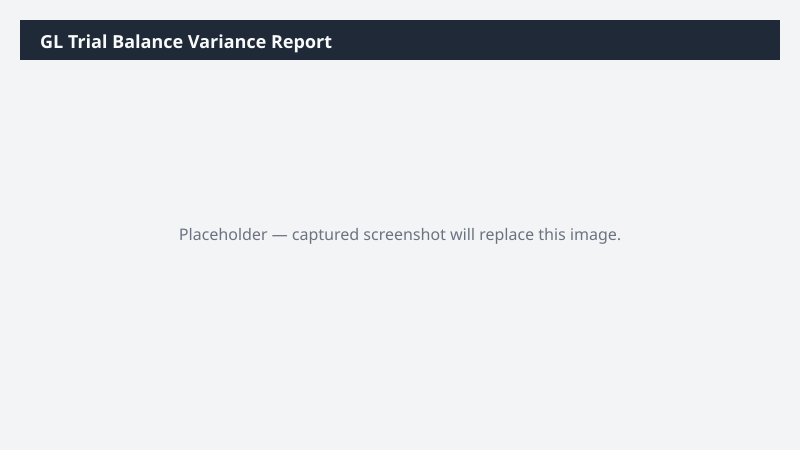

# GL Trial Balance Variance Report

Compares the current-period trial balance to the prior period and highlights GL accounts with material variances.

## What it does

Pulls the trial balance for two consecutive periods, computes variance, flags material lines, and produces a workbook + email draft.

## Prerequisites

- Dynamics 365 F&SCM access with the General ledger user role
- Cowork D365 ERP plugin enabled

## Step-by-step

1. Open Cowork and paste the prompt.
2. Approve the read-only data access when prompted.
3. Review the produced workbook in the side panel.
4. Edit the email draft recipients before sending.

## Expected output

An Excel workbook with Material/All sheets and a draft email summarizing the top variances.

## Skills used

OOTB: Excel, Email
Plugin actions: dynamics-365-erp/trial-balance-query

## License

CC-BY-4.0 — see repo `LICENSE`.
