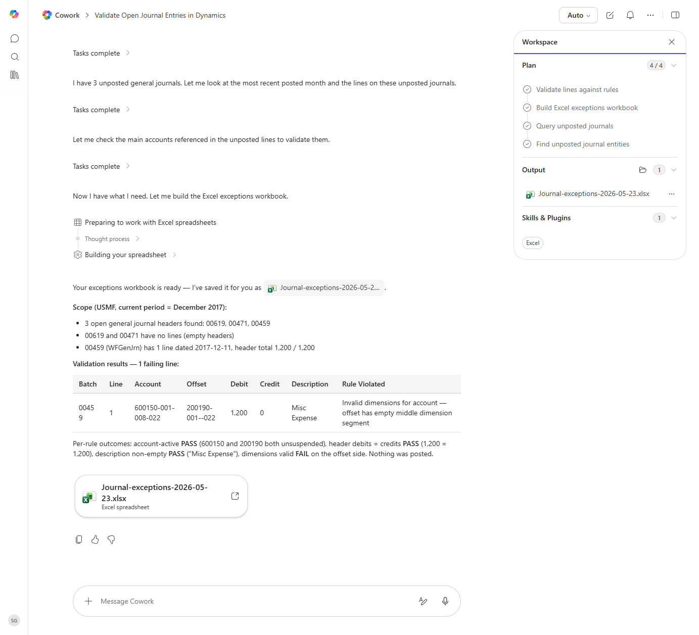

# Journal Entry Pre-Posting Validation

Validates open journal entries against a configurable rule set before posting and produces an exception report.

> ℹ **Tenant data caveat.** Validated end-to-end against a live Cowork tenant on 2026-05-23 with USMF (scope: December 2017). Cowork found 3 open general-journal headers (00619, 00471, 00459) and ran all four validation rules (account active, dimensions valid, debits=credits, description non-empty). Produced 'Journal-exceptions-2026-05-23.xlsx' with 1 failing line: batch 00459 line 1 (account 600150-001-008-022, debit 1200) - failed the 'dimensions valid' rule because the offset 200190-001--022 has an empty middle dimension segment. Other three rules PASS-ed. Nothing was posted.

## Business value

Catches posting errors before they hit the ledger, eliminating the reverse-and-repost cycles that delay close.

## What it does

Reads open journals and runs validation rules. Output is a workbook of exceptions for the GL team to triage.

## Prerequisites

- Dynamics 365 F&SCM access with the General ledger user role
- Cowork D365 ERP plugin enabled

## Step-by-step

1. Open Cowork and paste the prompt.
2. Approve the read-only data access.
3. Review the exceptions sheet; resolve in D365 before posting.

## Expected output

One workbook with one row per failing journal line and the rule that failed.

## Skills used

OOTB: Excel
Plugin actions: dynamics-365-erp/data_find_entity_type, dynamics-365-erp/data_find_entities_sql

## License

CC-BY-4.0 — see repo `LICENSE`.
